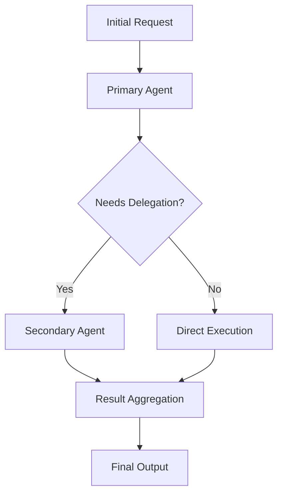

# CLAUDE-patterns.md
<!-- Established code patterns and conventions for SKIIN Switzerland -->

## React Component Patterns

### Atomic Design Structure (≤50 lines rule)
```typescript
// Atoms: ≤50 lines, single responsibility
export const Button: React.FC<ButtonProps> = ({ children, ...props }) => {
  return <button className="..." {...props}>{children}</button>;
};

// Molecules: Compose atoms, ≤50 lines for simple molecules
export const FormField = ({ label, error, children }) => (
  <div className="space-y-2">
    <Label>{label}</Label>
    {children}
    {error && <ErrorMessage>{error}</ErrorMessage>}
  </div>
);

// Organisms: Business logic, can exceed 50 lines
export const EligibilityForm = () => {
  const { control, handleSubmit } = useForm();
  // Complex business logic here
};
```

### State Management Patterns
```typescript
// Context for global state (eligibility, auth)
const AppContext = createContext<AppState>({});

// TanStack Query for server state
const { data, isLoading } = useQuery({
  queryKey: ['users'],
  queryFn: fetchUsers
});

// Local state for UI-only concerns
const [isOpen, setIsOpen] = useState(false);

// Multi-step wizard state management
const [currentStep, setCurrentStep] = useState(0);
const [wizardData, setWizardData] = useState<WizardData>({});

// Progress tracking pattern
const useStepProgress = (totalSteps: number) => {
  const [currentStep, setCurrentStep] = useState(0);
  const progress = (currentStep / totalSteps) * 100;
  return { currentStep, setCurrentStep, progress };
};
```

### Form Patterns (React Hook Form + Zod)
```typescript
// Schema definition with Zod
const schema = z.object({
  email: z.string().email(),
  age: z.number().min(18).max(120)
});

// Form with validation
const form = useForm<FormData>({
  resolver: zodResolver(schema),
  defaultValues: { email: '', age: 18 }
});
```

## TypeScript Patterns

### Strict Type Safety
```typescript
// No any types allowed
"strict": true,
"noImplicitAny": true,

// Explicit return types required
export const calculate = (a: number, b: number): number => {
  return a + b;
};

// Interface over type for component props
interface ButtonProps {
  variant?: 'primary' | 'secondary';
  size?: 'sm' | 'md' | 'lg';
}
```

### Swiss Compliance Patterns
```typescript
// VAT calculation (7.7%)
const VAT_RATE = 0.077;
const calculateVAT = (amount: number): number => amount * VAT_RATE;

// Canton validation
const SWISS_CANTONS = ['ZH', 'BE', 'LU', ...] as const;
type Canton = typeof SWISS_CANTONS[number];

// Age restriction
const MIN_AGE = 18;
const MAX_AGE = 120;
```

## Supabase Patterns

### Authentication with OTP
```typescript
// OTP verification with rate limiting
const verifyOTP = async (email: string, token: string) => {
  // Check rate limit (5 attempts per 10 minutes)
  const attempts = await checkRateLimit(email);
  if (attempts >= 5) throw new Error('Rate limit exceeded');
  
  // Verify with bcrypt
  const { data, error } = await supabase.auth.verifyOtp({
    email, token, type: 'email'
  });
};
```

### GP Referral Code System Patterns
```typescript
// 6-character code generation (3 letters + 3 numbers)
const generateReferralCode = (): string => {
  const letters = Array.from({length: 3}, () => 
    String.fromCharCode(65 + Math.floor(Math.random() * 26))
  ).join('');
  const numbers = Array.from({length: 3}, () => 
    Math.floor(Math.random() * 10)
  ).join('');
  return `${letters}${numbers}`; // Format: ABC123
};

// Code verification with bcrypt
const verifyReferralCode = async (code: string) => {
  const { data } = await supabase.rpc('verify_referral_code', {
    input_code: code
  });
  return data;
};

// HIN email validation (Swiss healthcare)
const isValidHINEmail = (email: string): boolean => {
  return /^[a-zA-Z0-9._%+-]+@[a-zA-Z0-9.-]*\.hin\.ch$/.test(email);
};
```

### RLS Policies Pattern
```sql
-- Row Level Security for user data
CREATE POLICY "Users can view own data" ON users
  FOR SELECT USING (auth.uid() = id);

CREATE POLICY "Users can update own profile" ON users
  FOR UPDATE USING (auth.uid() = id);

-- GP Referral RLS Policies
CREATE POLICY "Doctors can view own referral codes" ON referral_codes
  FOR SELECT USING (auth.uid() = doctor_id);

CREATE POLICY "Doctors can create referral codes" ON referral_codes
  FOR INSERT WITH CHECK (auth.uid() = doctor_id);
```

## Agent System Patterns

### Agent Standardization (v2.1)
All 20 agents now follow standardized patterns:

```yaml
---
name: agent-name
description: Clear description with usage examples
self_prime: true          # REQUIRED - Autonomous self-initialization
request_id: string        # REQUIRED - Request tracking for debugging
tools: [tool1, tool2]     # Available tools list
model: sonnet             # Model specification
color: cyan               # UI color theme
---
```

### Agent Self-Priming Pattern
Every agent automatically loads relevant context on invocation:

```typescript
// Self-priming behavior (happens automatically)
1. Load relevant project context files
2. Understand current system state
3. Apply domain-specific knowledge
4. Execute task with full awareness
```

### Request Tracking Pattern
All agents track requests for debugging and continuity:

```yaml
# In agent frontmatter
request_id: string     # Unique identifier for request chain
parent_request: string # Links to parent request if applicable

# Usage in agent responses
Request ID: req_2025_08_25_001
Parent: req_2025_08_25_000
Status: completed
```

### Agent Invocation Chain Pattern
Structured approach to multi-agent workflows:



## File Organization Patterns

### Strict Location Rules
- `/src/components/` - All React components
- `/public/assets/images/` - All images
- `/supabase/` - All database files
- `/tests/` - All test files
- `/docs/` - Reference documentation (organized by category)
- `/context/` - Active working files (CLAUDE-* memory bank files)
- `/scripts/` - Automation scripts
- `/.claude/agents/` - All 20 standardized agent files

### Documentation Structure Pattern (v2.1)
```
docs/
├── architecture/          # System design & technical architecture
│   ├── README.md         # High-level overview
│   ├── api.md           # API specifications
│   ├── database.md      # Database design
│   └── system-architecture.md
├── content/              # Master copy documents & translations
│   └── translations/    # 4 language versions
├── design-system/       # Component specs & design tokens
│   ├── components/     # Individual component documentation
│   └── tokens.md      # Design system tokens
├── features/           # Feature-specific documentation
│   ├── README.md      # Feature overview
│   ├── eligibility.md # Eligibility workflow
│   └── multi-language.md
├── frontend/          # Frontend architecture & patterns
│   ├── README.md     # Component organization
│   ├── components.md # Component catalog
│   └── design-system.md
├── standards/        # Coding standards & guidelines
│   ├── coding-standards.md
│   └── accessibility-guidelines.md
├── testing/         # Testing strategy & specifications
│   ├── README.md   # Testing overview
│   ├── unit-tests.md
│   └── e2e-tests.md
└── research/       # Research findings & best practices
    └── supabase-best-practices-comprehensive-guide.md
```

### Component File Structure
```
src/components/forms/eligibility/
├── components/        # Shared components
├── steps/            # Individual form steps
├── context/          # State management
├── utils/           # Business logic
└── index.tsx        # Main export
```

### Memory Bank File Pattern (CLAUDE-* files)
```
context/
├── CLAUDE-patterns.md        # Code patterns & conventions (this file)
├── CLAUDE-decisions.md       # Architecture decisions
├── CLAUDE-activeContext.md   # Current session state
├── CLAUDE-planning.md        # Active planning document
├── CLAUDE-todo.md           # Task tracking (synchronized with TodoWrite)
├── CLAUDE-temp.md           # Temporary scratch work
├── CLAUDE-config-variables.md  # Configuration reference
├── CLAUDE-troubleshooting.md   # Common issues & solutions
├── CLAUDE_PROCESS.md        # Agent workflow process
└── WORKFLOWS.md             # Workflow detection system
```

### System Automation Patterns

#### Hook Prevention Pattern
Implemented fixes to prevent automatic directory creation:

```python
# update-event-stream.py - Fixed hook that was creating subagent-contexts/
# OLD: os.makedirs("context/subagent-contexts", exist_ok=True) 
# NEW: Removed - directory no longer auto-created
```

#### Autonomous System Pattern
System now operates without manual intervention:

```yaml
System State: FULLY_AUTONOMOUS
Self-Correcting: true
Self-Updating: true
Manual Intervention Required: false

Capabilities:
- Agent standardization (20/20 agents)
- Hook automation fixes
- File organization compliance
- Memory bank synchronization
- Workflow detection and execution
```

#### Project Index Integration Pattern
Systematic approach to project context:

```bash
# Generate all 4 project indexes
./scripts/generate-indexes.sh

# Indexes available:
PROJECT_INDEX.json         # ~160KB - Code structure
VISUAL_ASSETS_INDEX.json   # ~124KB - Visual assets  
project-tree.txt          # ~36KB - Directory tree
project-index.md          # ~10KB - High-level overview
```

### Documentation Maintenance Patterns

#### Archive-to-Active Recovery Pattern
```bash
# When recovering valuable documentation from archives
1. Identify valuable content in archive directories
2. Extract and reorganize by category (architecture, design-system, etc.)
3. Update file references and cross-links
4. Create comprehensive README files for each category
5. Archive old disorganized structure
```

#### README-First Documentation Pattern
```markdown
# Each documentation category starts with README.md
## Overview
Brief description of category content

## Key Documents
- [Document](./document.md) - Purpose and scope

## Related Documentation
Cross-references to other categories
```

#### Category-Based Organization Pattern
- **architecture/**: System design, database, API specifications
- **design-system/**: Component specs, tokens, design guidelines  
- **features/**: User-facing functionality documentation
- **frontend/**: Component patterns, React architecture
- **standards/**: Coding standards, accessibility guidelines
- **testing/**: Test strategy, unit tests, E2E tests
- **research/**: Best practices, external research findings

## Testing Patterns

### Unit Test Structure
```typescript
describe('Component', () => {
  it('should render correctly', () => {
    const { getByText } = render(<Component />);
    expect(getByText('Expected')).toBeInTheDocument();
  });
  
  it('should handle user interaction', async () => {
    const user = userEvent.setup();
    // Test interaction
  });
});
```

### E2E Test Pattern (Playwright)
```typescript
test('user can complete eligibility form', async ({ page }) => {
  await page.goto('/eligibility');
  await page.fill('[name="email"]', 'test@example.com');
  await page.click('button[type="submit"]');
  await expect(page).toHaveURL('/eligibility/step-2');
});
```

## Performance Patterns

### Code Splitting
```typescript
// Lazy load heavy components
const Dashboard = lazy(() => import('./Dashboard'));

// Suspense boundary
<Suspense fallback={<Loading />}>
  <Dashboard />
</Suspense>
```

### Memoization
```typescript
// Memo for expensive renders
const ExpensiveComponent = memo(({ data }) => {
  return <ComplexVisualization data={data} />;
});

// useMemo for expensive calculations
const processedData = useMemo(() => 
  expensiveCalculation(rawData), [rawData]
);
```

## Accessibility Patterns

### WCAG 2.1 AA Compliance
```typescript
// Semantic HTML
<nav aria-label="Main navigation">
  <ul role="list">...</ul>
</nav>

// ARIA labels for interactive elements
<button aria-label="Close dialog" onClick={onClose}>
  <X className="h-4 w-4" />
</button>

// Focus management
useEffect(() => {
  if (isOpen) firstInputRef.current?.focus();
}, [isOpen]);
```

## Multi-language Patterns

### i18n Structure
```typescript
// Route structure: /[lang]/[page]
const routes = {
  en: '/en/home',
  de: '/de/home',
  fr: '/fr/accueil',
  it: '/it/home'
};

// Translation hook
const { t } = useTranslation();
return <h1>{t('welcome.title')}</h1>;
```

## Visual Component Patterns

### QR Code Generation Pattern
```typescript
// QR code for referral codes
const QRCodeGenerator: React.FC<QRProps> = ({ value, size = 128 }) => {
  return (
    <QRCodeSVG
      value={value}
      size={size}
      bgColor="#ffffff"
      fgColor="#000000"
      level="M"
      includeMargin={true}
    />
  );
};
```

### Countdown Timer Pattern
```typescript
// Expiry countdown with visual feedback
const useCountdown = (targetDate: Date) => {
  const [timeLeft, setTimeLeft] = useState(calculateTimeLeft());
  
  useEffect(() => {
    const timer = setInterval(() => {
      setTimeLeft(calculateTimeLeft());
    }, 1000);
    return () => clearInterval(timer);
  }, [targetDate]);
  
  return timeLeft;
};
```

## File Upload Patterns

### Multi-file Upload with Validation
```typescript
// File validation patterns
const validateFile = (file: File): string | null => {
  const maxSize = 10 * 1024 * 1024; // 10MB
  const allowedTypes = ['application/pdf', 'image/jpeg', 'image/png', 'image/heic'];
  
  if (file.size > maxSize) return 'File size must be less than 10MB';
  if (!allowedTypes.includes(file.type)) return 'Invalid file type';
  return null;
};

// Drag & drop handling
const useFileUpload = () => {
  const [files, setFiles] = useState<File[]>([]);
  const [dragActive, setDragActive] = useState(false);
  
  const handleDrop = useCallback((e: DragEvent) => {
    e.preventDefault();
    const droppedFiles = Array.from(e.dataTransfer?.files || []);
    setFiles(prev => [...prev, ...droppedFiles]);
  }, []);
  
  return { files, setFiles, dragActive, setDragActive, handleDrop };
};
```

## Email Service Patterns

### Resend Integration Pattern
```typescript
// Professional email templates
const sendReferralConfirmation = async ({
  doctorEmail,
  patientEmail,
  referralCode,
  doctorName
}: EmailData) => {
  const response = await fetch('/api/send-email', {
    method: 'POST',
    headers: { 'Content-Type': 'application/json' },
    body: JSON.stringify({
      to: doctorEmail,
      subject: 'SKIIN Referral Code Generated',
      template: 'referral-confirmation',
      data: { referralCode, patientEmail, doctorName }
    })
  });
  return response.json();
};
```

## Error Handling Patterns

### Try-Catch with Toast Feedback
```typescript
try {
  const result = await riskyOperation();
  toast.success('Operation successful');
} catch (error) {
  console.error('Operation failed:', error);
  toast.error('Something went wrong. Please try again.');
}
```

### Error Boundaries
```typescript
class ErrorBoundary extends Component {
  componentDidCatch(error: Error, info: ErrorInfo) {
    logErrorToService(error, info);
  }
  
  render() {
    if (this.state.hasError) {
      return <ErrorFallback />;
    }
    return this.props.children;
  }
}
```

---
*Last updated: 2025-08-25 | These patterns are enforced project-wide*