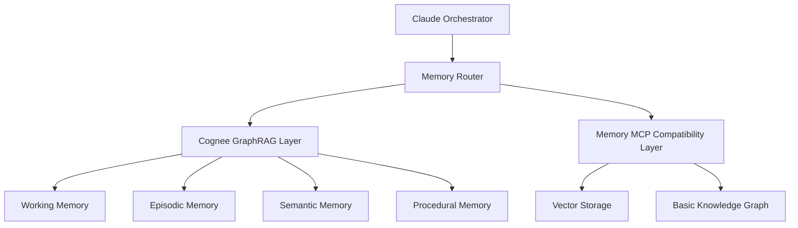

# Cognee Memory Protocol for Claude Code
VERSION: 1.0
CREATED: 2025-08-24
PURPOSE: Define comprehensive memory protocol leveraging Cognee for persistent context management
STATUS: DRAFT

## Executive Summary

This protocol defines the integration of Cognee as the advanced memory system for Claude Code, enhancing the current memory MCP with GraphRAG capabilities, ontology-based reasoning, and intelligent context engineering. Based on multi-panel review, we recommend the **Progressive Ontology Migration** approach with domain-specific optimizations.

## 1. Memory Architecture Overview

### 1.1 Hybrid Memory Stack



### 1.2 Memory Types & Agent Mapping

| Memory Type | Purpose | Primary Agents | Storage Pattern |
|-------------|---------|----------------|-----------------|
| **Working Memory** | Short-term task context | All agents | Session-based, 24hr TTL |
| **Episodic Memory** | Project events & interactions | context-manager, documentation-maintainer | Event-indexed, permanent |
| **Semantic Memory** | Domain knowledge & facts | researcher, tree-of-thought-agent | Graph-based, versioned |
| **Procedural Memory** | Workflows & procedures | planning-task-agent, invocation-chain-generator | Pattern-based, evolving |

## 2. Domain Ontology

### 2.1 Core Entity Types (Extended from conventions.md)

```typescript
// Base entity types from current system
interface BaseEntity {
  id: string;
  name: string;
  created_at: Date;
  updated_at: Date;
  version: string;
}

// Enhanced entity types for Cognee
interface CogneeEntity extends BaseEntity {
  // Core entities from conventions.md
  Task: {
    description: string;
    status: 'pending' | 'in_progress' | 'complete';
    priority: number;
    agent_assigned?: string;
    memory_type: 'working' | 'procedural';
  };
  
  Phase: {
    order: number;
    description: string;
    memory_type: 'procedural';
  };
  
  Requirement: {
    type: 'functional' | 'nonfunctional';
    acceptance_criteria: string[];
    status: string;
    memory_type: 'semantic';
  };
  
  File: {
    path: string;
    description: string;
    status: 'draft' | 'review' | 'approved' | 'delivered' | 'archived';
    memory_type: 'semantic';
  };
  
  Agent: {
    domain: string;
    model: string;
    capabilities: string[];
    memory_profile: MemoryProfile;
  };
  
  // New Cognee-specific entities
  Context: {
    scope: 'session' | 'project' | 'global';
    budget_kb: number;
    active_agents: string[];
    memory_type: 'working';
  };
  
  Knowledge: {
    domain: 'healthcare' | 'technical' | 'regulatory' | 'design';
    confidence: number;
    sources: string[];
    memory_type: 'semantic';
  };
  
  Pattern: {
    type: 'workflow' | 'error' | 'optimization';
    frequency: number;
    last_occurrence: Date;
    memory_type: 'procedural';
  };
  
  Decision: {
    rationale: string;
    alternatives: string[];
    impact: 'high' | 'medium' | 'low';
    memory_type: 'episodic';
  };
}
```

### 2.2 Relation Types (GraphRAG Enhanced)

```typescript
interface CogneeRelations {
  // Existing relations from conventions.md
  depends_on: Edge<Task, Task>;
  belongs_to: Edge<Task | Document, Phase | Plan>;
  assigned_to: Edge<Task, Agent>;
  created_by: Edge<Entity, Agent>;
  implements: Edge<Task, Requirement>;
  uses: Edge<Task | Agent, Tool | Component>;
  
  // New Cognee relations for inference
  infers: Edge<Knowledge, Knowledge>;  // Ontology-based inference
  contradicts: Edge<Knowledge, Knowledge>;  // Conflict detection
  validates: Edge<Pattern, Decision>;  // Pattern validation
  evolves_from: Edge<Entity, Entity>;  // Version evolution
  semantically_similar: Edge<Entity, Entity>;  // Vector similarity
  triggers: Edge<Event, Pattern>;  // Event-pattern linkage
  recommends: Edge<Pattern, Action>;  // Predictive suggestions
}
```

### 2.3 Swiss Healthcare Domain Ontology

```yaml
healthcare_ontology:
  entities:
    MedicalClaim:
      properties: [claim_text, evidence_level, regulatory_status]
      relations: [requires_approval, supported_by, contradicted_by]
    
    RegulatoryRequirement:
      properties: [jurisdiction, compliance_level, last_updated]
      relations: [applies_to, supersedes, enforced_by]
    
    PatientData:
      properties: [data_type, privacy_level, retention_period]
      relations: [protected_by, accessed_by, anonymized_for]
    
    ClinicalValidation:
      properties: [validation_type, authority, expiry_date]
      relations: [validates, required_for, renewed_by]
  
  inference_rules:
    - IF entity.type = 'MedicalClaim' AND NOT exists(regulatory_approval) 
      THEN flag_for_review
    - IF data.privacy_level = 'sensitive' 
      THEN apply_encryption AND limit_access
    - IF validation.expiry_date < current_date 
      THEN trigger_renewal_workflow
```

## 3. Context Engineering Patterns

### 3.1 Progressive Context Loading Strategy

```typescript
class CogneeContextManager {
  async loadContext(agent: Agent, task: Task): Promise<Context> {
    // Phase 1: Load core context (<15KB)
    const coreContext = await this.loadCoreContext({
      project_index: 'PROJECT_INDEX.json',
      agent_profile: agent.memory_profile,
      task_requirements: task.requirements
    });
    
    // Phase 2: Expand with relevant semantic memory (<30KB)
    const semanticContext = await cognee.search({
      query: task.description,
      memory_type: 'semantic',
      limit: 30000,  // bytes
      filters: {
        domain: agent.domain,
        confidence: { gte: 0.7 }
      }
    });
    
    // Phase 3: Add episodic context if needed (<20KB)
    const episodicContext = await this.loadRecentEvents({
      agent: agent.name,
      task_type: task.type,
      time_window: '7d',
      limit: 20000  // bytes
    });
    
    // Phase 4: Include procedural patterns (<15KB)
    const proceduralContext = await cognee.getPatterns({
      workflow: task.workflow_type,
      frequency: { gte: 3 },
      limit: 15000  // bytes
    });
    
    // Ensure total < 100KB budget
    return this.optimizeContext({
      core: coreContext,
      semantic: semanticContext,
      episodic: episodicContext,
      procedural: proceduralContext,
      budget: 100000  // bytes
    });
  }
}
```

### 3.2 Agent Memory Profiles

```yaml
agent_memory_profiles:
  researcher:
    primary: [semantic, episodic]
    secondary: [working]
    retention: permanent
    inference: enabled
    
  planning-task-agent:
    primary: [procedural, working]
    secondary: [semantic]
    retention: project_lifetime
    pattern_recognition: enabled
    
  frontend-developer:
    primary: [working, semantic]
    secondary: [procedural]
    retention: session
    component_cache: enabled
    
  context-manager:
    primary: [working, episodic, semantic, procedural]
    secondary: []
    retention: permanent
    orchestration: enabled
    
  documentation-maintainer:
    primary: [semantic, episodic]
    secondary: [working]
    retention: permanent
    versioning: enabled
```

## 4. Integration with Current Process

### 4.1 CLAUDE_PROCESS.md Integration Points

```yaml
phase_integration:
  context_gathering:
    - Load PROJECT_INDEX.json into Cognee semantic memory
    - Retrieve relevant past contexts from episodic memory
    - Apply pattern recognition for similar past scenarios
    
  analysis:
    - Build knowledge graph in Cognee
    - Apply ontology-based inference
    - Detect contradictions and gaps
    
  research:
    - Store findings in semantic memory
    - Create knowledge relations
    - Enable cross-reference discovery
    
  brainstorming:
    - Access procedural patterns
    - Generate variations using semantic similarity
    - Store evaluated options
    
  planning:
    - Retrieve successful past plans
    - Apply procedural memory for workflows
    - Store plan evolution
    
  execution:
    - Real-time working memory updates
    - Pattern detection for optimization
    - Checkpoint storage in episodic memory
    
  review:
    - Access complete project history
    - Pattern analysis for lessons learned
    - Update procedural memory
    
  delivery:
    - Archive to long-term semantic memory
    - Extract patterns for future projects
    - Update domain ontology
```

### 4.2 Documentation Lifecycle Integration

```typescript
class CogneeDocumentationManager {
  async processDocument(doc: Document, phase: 'creation' | 'active' | 'archive') {
    switch(phase) {
      case 'creation':
        // Extract knowledge and add to semantic memory
        await cognee.add(doc.content);
        await cognee.cognify();
        // Create entity in knowledge graph
        await this.createDocumentEntity(doc);
        break;
        
      case 'active':
        // Update semantic memory with changes
        await this.updateSemanticMemory(doc);
        // Track usage in episodic memory
        await this.logDocumentAccess(doc);
        break;
        
      case 'archive':
        // Move to long-term storage
        await this.archiveToSemantic(doc);
        // Extract patterns for procedural memory
        await this.extractPatterns(doc);
        // Update ontology if needed
        await this.updateOntology(doc);
        break;
    }
  }
}
```

### 4.3 Event Stream Processing

```typescript
class CogneeEventProcessor {
  async processEvent(event: Event) {
    // Real-time event processing
    const processed = await this.parseEvent(event);
    
    // Store in episodic memory
    await cognee.addEpisode({
      timestamp: event.timestamp,
      phase: event.phase,
      agent: event.agent,
      action: event.action,
      outcome: event.outcome
    });
    
    // Pattern detection
    const patterns = await this.detectPatterns(processed);
    if (patterns.length > 0) {
      await cognee.updateProcedural(patterns);
    }
    
    // Ontology evolution
    if (this.isNewConcept(processed)) {
      await this.proposeOntologyUpdate(processed);
    }
    
    // Predictive insights
    const predictions = await cognee.predict(processed);
    if (predictions.confidence > 0.8) {
      await this.notifyOrchestrator(predictions);
    }
  }
}
```

## 5. API Specification

### 5.1 Core Cognee Operations

```typescript
// Initialize Cognee with configuration
await cognee.init({
  api_key: process.env.COGNEE_API_KEY,
  vector_store: 'qdrant',
  graph_db: 'neo4j',
  memory_types: ['working', 'episodic', 'semantic', 'procedural']
});

// Add data to memory
await cognee.add({
  content: 'Task completion report...',
  metadata: {
    agent: 'frontend-developer',
    task_id: 'TASK-001',
    memory_type: 'episodic'
  }
});

// Process and build knowledge graph
await cognee.cognify({
  ontology: swissHealthcareOntology,
  inference: true,
  pattern_detection: true
});

// Search with context awareness
const results = await cognee.search({
  query: 'Swiss healthcare compliance requirements',
  memory_types: ['semantic', 'procedural'],
  context: currentContext,
  inference: true
});

// Prune obsolete memories
await cognee.prune({
  older_than: '30d',
  exclude_types: ['semantic', 'procedural'],
  preserve_patterns: true
});
```

### 5.2 Migration API

```typescript
class CogneeMigration {
  // Migrate from memory MCP to Cognee
  async migrateVectorStorage() {
    const vectors = await memoryMCP.getAllVectors();
    for (const vector of vectors) {
      await cognee.add(vector.content);
    }
    await cognee.cognify();
  }
  
  // Migrate knowledge graph
  async migrateKnowledgeGraph() {
    const entities = await memoryMCP.getAllEntities();
    const relations = await memoryMCP.getAllRelations();
    
    await cognee.importGraph({
      entities: entities,
      relations: relations,
      ontology: enhancedOntology
    });
  }
  
  // Verify migration
  async verifyMigration() {
    const tests = [
      this.testVectorSearch(),
      this.testGraphQueries(),
      this.testInference(),
      this.testPatternRecognition()
    ];
    
    return Promise.all(tests);
  }
}
```

## 6. Testing Protocol

### 6.1 Integration Testing

```typescript
describe('Cognee Memory Integration', () => {
  // Test memory type allocation
  test('Agent memory profiles correctly applied', async () => {
    const researcher = await getAgent('researcher');
    const memory = await cognee.getMemoryProfile(researcher);
    expect(memory.primary).toContain('semantic');
    expect(memory.primary).toContain('episodic');
  });
  
  // Test context budget management
  test('Context stays within 100KB budget', async () => {
    const context = await loadContext('frontend-developer', mockTask);
    expect(context.size).toBeLessThan(100000);
  });
  
  // Test ontology inference
  test('Healthcare ontology inference works', async () => {
    await cognee.add('Medical claim without approval');
    await cognee.cognify();
    const alerts = await cognee.getAlerts();
    expect(alerts).toContainEqual({
      type: 'regulatory_review_required'
    });
  });
  
  // Test pattern recognition
  test('Workflow patterns detected', async () => {
    await simulateWorkflow('bug-fix', 5);  // Run 5 times
    const patterns = await cognee.getPatterns('bug-fix');
    expect(patterns.length).toBeGreaterThan(0);
  });
});
```

### 6.2 Performance Testing

```yaml
performance_benchmarks:
  context_loading:
    target: <500ms
    max: 1000ms
    
  semantic_search:
    target: <200ms
    max: 500ms
    
  pattern_recognition:
    target: <1000ms
    max: 2000ms
    
  memory_cognify:
    target: <30s for 1MB
    max: 60s for 1MB
    
  graph_traversal:
    target: <100ms for 3-hop
    max: 300ms for 3-hop
```

### 6.3 Migration Testing

```typescript
class MigrationTest {
  async testPhase1() {
    // Test high-value agent migration
    await migrate(['researcher', 'tree-of-thought-agent']);
    
    // Verify functionality
    const researchResult = await researcher.search('test query');
    expect(researchResult.source).toBe('cognee');
    
    // Verify backward compatibility
    const legacyResult = await memoryMCP.recall('test-key');
    expect(legacyResult).toBeDefined();
  }
  
  async testPhase2() {
    // Test core agent integration
    await migrate(['brainstormer', 'planning-task-agent']);
    
    // Test cross-agent knowledge sharing
    const sharedKnowledge = await cognee.getSharedKnowledge(
      'researcher', 
      'brainstormer'
    );
    expect(sharedKnowledge.length).toBeGreaterThan(0);
  }
  
  async testPhase3() {
    // Test full migration
    await migrateAll();
    
    // Verify all agents functional
    const allAgents = await getAllAgents();
    for (const agent of allAgents) {
      const memory = await agent.getMemory();
      expect(memory.provider).toBe('cognee');
    }
  }
}
```

## 7. Rollout Plan

### Phase 1: Foundation (Weeks 1-3)
- [ ] Install and configure Cognee MCP
- [ ] Develop Swiss healthcare ontology
- [ ] Create memory router component
- [ ] Migrate researcher and tree-of-thought-agent
- [ ] Establish performance baselines

### Phase 2: Core Integration (Weeks 4-7)
- [ ] Migrate brainstormer and planning-task-agent
- [ ] Implement cross-agent semantic linking
- [ ] Integrate documentation lifecycle
- [ ] Optimize context loading
- [ ] Enable pattern recognition

### Phase 3: Full Migration (Weeks 8-12)
- [ ] Migrate all remaining agents
- [ ] Enable ontology-based inference
- [ ] Implement predictive insights
- [ ] Performance optimization
- [ ] Sunset memory MCP

## 8. Success Metrics

### Quantitative Metrics
- **Context Relevance**: >85% relevant context retrieval
- **Hallucination Reduction**: >40% reduction in errors
- **Performance**: All operations within benchmark targets
- **Memory Efficiency**: <100KB context budget maintained
- **Pattern Recognition**: >70% workflow pattern detection

### Qualitative Metrics
- **Developer Experience**: Simplified memory operations
- **Agent Coordination**: Improved knowledge sharing
- **Domain Accuracy**: Enhanced healthcare compliance
- **System Reliability**: Reduced memory-related failures
- **Maintenance**: Easier ontology updates

## 9. Risk Management

### Technical Risks
| Risk | Likelihood | Impact | Mitigation |
|------|------------|--------|------------|
| Performance degradation | Medium | High | Comprehensive benchmarking, gradual rollout |
| Ontology complexity | High | Medium | Iterative refinement, domain expert review |
| Migration data loss | Low | High | Full backups, parallel running |
| Integration conflicts | Medium | Medium | Compatibility layer, extensive testing |

### Operational Risks
| Risk | Likelihood | Impact | Mitigation |
|------|------------|--------|------------|
| Team learning curve | High | Medium | Training sessions, documentation |
| Workflow disruption | Medium | High | Phased migration, rollback procedures |
| Cost overrun | Low | Medium | Fixed-scope phases, regular reviews |

## 10. Governance

### Decision Authority
- **Technical Lead**: Architecture decisions
- **Domain Expert**: Ontology approval
- **Project Manager**: Timeline and resources
- **QA Lead**: Testing and validation

### Review Checkpoints
- End of each phase
- After each agent migration
- Weekly performance reviews
- Ontology updates

### Documentation Requirements
- All changes logged in event-stream.md
- Migration progress in planning.md
- Lessons learned in memory
- Updated conventions.md

---

This protocol provides a comprehensive framework for integrating Cognee as the persistent memory system for Claude Code. The progressive migration approach balances innovation with stability, ensuring enhanced capabilities while maintaining system reliability.