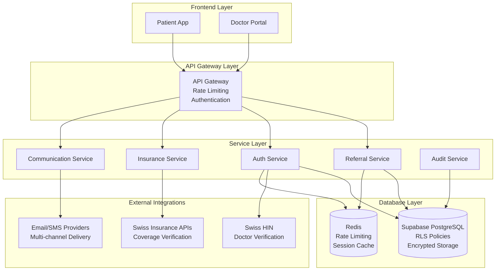

# GP Referral System - Implementation Roadmap
VERSION: 1.0
CREATED: 2025-08-22
PURPOSE: Structured implementation guide for Swiss GP referral system backend

## 1. Executive Summary

### Scope and Objectives
The GP referral system backend provides a comprehensive solution for Swiss healthcare providers to:
- Generate secure GP referral packages with QR codes and 6-digit access codes
- Enable doctors to validate and process referrals through a secure portal
- Integrate with Swiss insurance providers for coverage verification
- Maintain Swiss healthcare regulatory compliance (FADP, KVG, Article 321 StGB)
- Provide audit trails and security monitoring for medical data protection

### Delivered Specifications
1. **Complete OpenAPI 3.0 Specification** (40+ endpoints)
2. **Technical Architecture Guide** (PostgreSQL + Supabase + Edge Functions)
3. **Security & Compliance Framework** (P0 security fixes + Swiss regulations)
4. **Implementation Roadmap** (14-week delivery timeline)

## 2. Architecture Overview



## 3. Implementation Phases

### Phase 1: Core Infrastructure (Weeks 1-3)
**Duration**: 3 weeks
**Priority**: P0 - Critical Foundation

#### 1.1 Database Schema Implementation
- Deploy enhanced GP referrals table with security features
- Implement comprehensive RLS policies
- Set up audit logging tables
- Configure encryption at rest

```sql
-- Key tables to implement
- gp_referrals (enhanced with security fields)
- referral_access_logs (comprehensive audit trail)
- doctor_profiles (HIN integration ready)
- rate_limits (IP and user-based rate limiting)
- security_audit_log (compliance monitoring)
```

#### 1.2 Authentication Foundation
- Implement secure OTP system with bcrypt hashing
- Set up JWT authentication with role-based claims
- Configure rate limiting middleware (5 attempts/15 minutes)
- Implement session management with Redis

#### 1.3 Basic API Framework
- Set up Supabase Edge Functions architecture
- Implement request validation with Zod schemas
- Create error handling and structured logging
- Deploy development environment

**Deliverables**:
- ✅ Working database schema with RLS
- ✅ Secure OTP authentication system
- ✅ Basic API structure with validation
- ✅ Development environment setup

### Phase 2: Referral Generation System (Weeks 4-6)
**Duration**: 3 weeks  
**Priority**: P1 - Core Functionality

#### 2.1 Referral Creation API
- Implement `/api/referrals/generate` endpoint
- QR code generation with qrcode.js library
- 6-digit access code generation with crypto-secure random
- Patient data encryption with AES-256-GCM

#### 2.2 PDF Generation Service
- Integrate PDF generation with jsPDF/Puppeteer
- Multi-language templates (DE, FR, IT, EN)
- Swiss healthcare compliant formatting
- Secure file storage with Supabase Storage

#### 2.3 Multi-Channel Communication
- Email delivery with templated content (SendGrid/Postmark)
- SMS delivery for access codes (Twilio/MessageBird)
- Delivery status tracking and retry mechanisms
- Template management for 4 languages

**Deliverables**:
- ✅ Complete referral generation system
- ✅ QR code and PDF generation
- ✅ Multi-channel delivery (email/SMS)
- ✅ Encrypted patient data storage

### Phase 3: Doctor Portal Backend (Weeks 7-9)
**Duration**: 3 weeks
**Priority**: P1 - Doctor Workflow

#### 3.1 Referral Validation System
- Implement `/api/referrals/validate` endpoint
- QR code and 6-digit code validation
- Rate limiting for validation attempts
- Doctor credential verification

#### 3.2 HIN Integration
- Swiss Health Info Network API integration
- Doctor professional verification
- Credential caching and session management
- Practice information validation

#### 3.3 Referral Processing APIs
- `/api/referrals/{id}/details` for patient information
- `/api/referrals/{id}/submit` for doctor responses
- `/api/referrals/{id}/documents` for file uploads
- `/api/doctor/referrals` for doctor dashboard

**Deliverables**:
- ✅ Complete doctor authentication system
- ✅ HIN integration for professional verification
- ✅ Referral processing workflow
- ✅ Secure document handling

### Phase 4: Swiss Insurance Integration (Weeks 10-11)
**Duration**: 2 weeks
**Priority**: P2 - Insurance Features

#### 4.1 Insurance Provider Database
- Complete Swiss insurance provider directory
- Insurance model definitions (Standard, HMO, Hausarzt, Telmed)
- Coverage rules and referral requirements
- Real-time insurance verification

#### 4.2 Insurance APIs
- `/api/insurance/providers` endpoint
- `/api/insurance/verify` for coverage verification
- `/api/insurance/{provider}/requires-referral` logic
- Integration with major Swiss insurers (CSS, Helsana, SWICA, etc.)

**Deliverables**:
- ✅ Complete insurance provider integration
- ✅ Coverage verification system
- ✅ Referral requirement logic
- ✅ Real-time insurance APIs

### Phase 5: Security & Compliance (Weeks 12-13)
**Duration**: 2 weeks
**Priority**: P0 - Regulatory Compliance

#### 5.1 Advanced Security Features
- Enhanced audit trail implementation
- Anomaly detection algorithms
- Risk scoring for access attempts
- Real-time security alerting

#### 5.2 GDPR Compliance Implementation
- `/api/security/gdpr/export` for data portability
- `/api/security/gdpr/delete` for right to erasure
- Consent management integration
- Automated data retention policies

#### 5.3 Swiss Healthcare Compliance
- Article 321 StGB medical confidentiality compliance
- FADP data protection implementation
- Swiss healthcare audit requirements
- Cross-border data transfer restrictions

**Deliverables**:
- ✅ GDPR compliant data handling
- ✅ Swiss healthcare regulatory compliance
- ✅ Advanced security monitoring
- ✅ Automated compliance reporting

### Phase 6: Testing & Production Readiness (Week 14)
**Duration**: 1 week
**Priority**: P0 - Quality Assurance

#### 6.1 Comprehensive Testing
- Unit test coverage (90% target for services)
- Integration test suite (all API endpoints)
- Performance testing (1000+ concurrent users)
- Security penetration testing

#### 6.2 Production Deployment
- Production environment configuration
- SSL/TLS certificate management
- Database backup and disaster recovery
- Monitoring and alerting setup

#### 6.3 Go-Live Preparation
- Production data migration
- User acceptance testing
- Staff training documentation
- Support procedures documentation

**Deliverables**:
- ✅ Production-ready system
- ✅ Comprehensive test coverage
- ✅ Performance benchmarks met
- ✅ Go-live documentation complete

## 4. Technical Requirements Summary

### 4.1 Performance Targets
| Metric | Target | Measurement |
|--------|--------|-------------|
| Referral Generation | < 2 seconds | Including PDF generation |
| Code Validation | < 200ms | QR/6-digit code validation |
| Referral Details | < 500ms | Patient data retrieval |
| Document Upload | < 5 seconds | 50MB max file size |
| Concurrent Users | 1000+ | Simultaneous operations |

### 4.2 Security Requirements
| Feature | Implementation | Compliance |
|---------|----------------|-------------|
| Data Encryption | AES-256-GCM | Swiss FADP |
| Authentication | JWT + OTP with bcrypt | Article 321 StGB |
| Rate Limiting | 5 attempts/15 minutes | DDoS protection |
| Audit Logging | Comprehensive trail | Swiss healthcare regs |
| Access Control | Role-based (RBAC) | Medical data protection |

### 4.3 Integration Points
| System | Purpose | Protocol |
|---------|---------|----------|
| Swiss HIN | Doctor verification | REST API |
| Insurance APIs | Coverage verification | REST/SOAP |
| Email/SMS | Multi-channel delivery | SMTP/HTTP |
| PDF Generation | Document creation | Server-side rendering |
| File Storage | Encrypted document storage | Supabase Storage |

## 5. Development Resources

### 5.1 Team Structure
```
Project Manager (1) - Overall coordination
Senior Backend Developer (2) - Core API implementation  
Security Engineer (1) - Compliance and security features
Database Engineer (1) - Schema design and optimization
DevOps Engineer (1) - Infrastructure and deployment
QA Engineer (1) - Testing and quality assurance
```

### 5.2 Technology Stack
```yaml
Backend Framework: Supabase Edge Functions (Deno/TypeScript)
Database: PostgreSQL with RLS (Supabase)
Authentication: Supabase Auth + JWT
File Storage: Supabase Storage (encrypted)
Cache/Sessions: Redis
Email/SMS: SendGrid + Twilio
PDF Generation: jsPDF/Puppeteer
Monitoring: Sentry + Custom dashboard
```

### 5.3 Development Environment
```yaml
Development:
  - Local Supabase instance
  - Docker containers for Redis
  - Mock external APIs
  - Automated test suite

Staging:
  - Production-like Supabase project
  - Full external API integration
  - Performance testing tools
  - Security scanning

Production:
  - High-availability Supabase
  - Multi-region deployment
  - 24/7 monitoring
  - Automated backups
```

## 6. Risk Management

### 6.1 Technical Risks
| Risk | Impact | Mitigation |
|------|--------|------------|
| Supabase limitations | High | Hybrid architecture with custom functions |
| Swiss API integrations | Medium | Comprehensive testing and fallbacks |
| Performance bottlenecks | Medium | Load testing and optimization |
| Security vulnerabilities | Critical | Regular audits and penetration testing |

### 6.2 Compliance Risks
| Risk | Impact | Mitigation |
|------|--------|------------|
| GDPR violations | Critical | Legal review and compliance automation |
| Swiss healthcare regs | Critical | Regular compliance audits |
| Data breach | Critical | Advanced security monitoring |
| Audit failures | High | Comprehensive logging and reporting |

### 6.3 Business Risks
| Risk | Impact | Mitigation |
|------|--------|------------|
| Integration delays | Medium | Phased delivery approach |
| Scope creep | Medium | Fixed scope with change control |
| Resource constraints | High | Cross-training and documentation |
| Market changes | Low | Flexible architecture design |

## 7. Success Metrics

### 7.1 Technical KPIs
- **API Response Times**: 95% under target thresholds
- **System Uptime**: 99.9% availability
- **Security Incidents**: Zero critical vulnerabilities
- **Test Coverage**: 90%+ for critical services
- **Performance**: 1000+ concurrent users supported

### 7.2 Business KPIs  
- **Referral Generation Success Rate**: 98%+
- **Doctor Portal Adoption**: 80% of target practices
- **Insurance Integration Coverage**: 95% of Swiss insurers
- **Compliance Audit Score**: 100% on all critical requirements
- **User Satisfaction**: 4.5+ rating from healthcare providers

### 7.3 Compliance Metrics
- **GDPR Response Time**: < 30 days for data requests
- **Audit Trail Completeness**: 100% of all access events logged
- **Data Retention Compliance**: 100% automatic compliance
- **Security Assessment Score**: 95%+ on penetration tests
- **Regulatory Compliance**: 100% on Swiss healthcare requirements

## 8. Post-Launch Support

### 8.1 Maintenance Plan
- **Security Updates**: Monthly security patches
- **Feature Updates**: Quarterly feature releases
- **Performance Monitoring**: 24/7 system monitoring
- **Compliance Reviews**: Semi-annual compliance audits

### 8.2 Support Structure
- **Level 1**: Basic user support (response time: 4 hours)
- **Level 2**: Technical issues (response time: 2 hours)  
- **Level 3**: Critical system issues (response time: 30 minutes)
- **Emergency**: Security/compliance issues (response time: immediate)

### 8.3 Documentation Deliverables
- **API Documentation**: Complete OpenAPI specification
- **Architecture Guide**: System design and integration patterns
- **Security Manual**: Security procedures and compliance guides
- **Operations Manual**: Deployment, monitoring, and maintenance
- **User Guides**: Doctor portal and patient app usage guides

## 9. Conclusion

This comprehensive implementation roadmap provides a structured approach to delivering a secure, compliant, and scalable GP referral system for the Swiss healthcare market. The 14-week timeline balances the critical need for security and compliance with efficient delivery of core functionality.

The phased approach ensures that:
1. **Critical security fixes are implemented first** (addressing P0 issues from multi-panel review)
2. **Core functionality is delivered incrementally** (enabling early testing and feedback)
3. **Swiss regulatory compliance is embedded throughout** (not added as an afterthought)
4. **Quality and performance standards are maintained** (through comprehensive testing)

With proper resource allocation and adherence to this roadmap, the GP referral system will provide a robust foundation for Swiss healthcare providers while meeting all regulatory requirements and performance targets.

### Next Steps for Implementation Team
1. **Review and approve technical architecture** (Week 0)
2. **Set up development environments** (Week 1)
3. **Begin Phase 1 database implementation** (Week 1)
4. **Establish security review processes** (Week 1)
5. **Configure CI/CD pipeline** (Week 2)
6. **Start regular compliance checkpoints** (Week 2)

The specifications provided in this document series are ready for immediate implementation and provide comprehensive guidance for building a production-ready Swiss GP referral system.