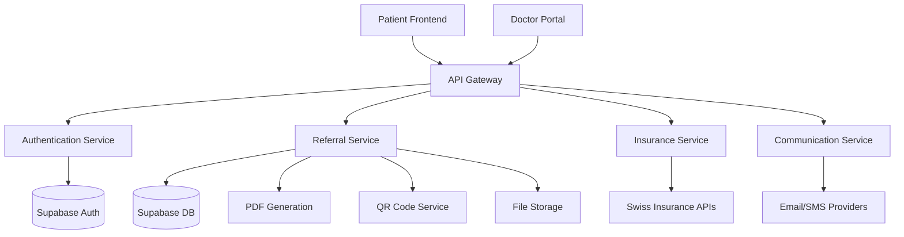
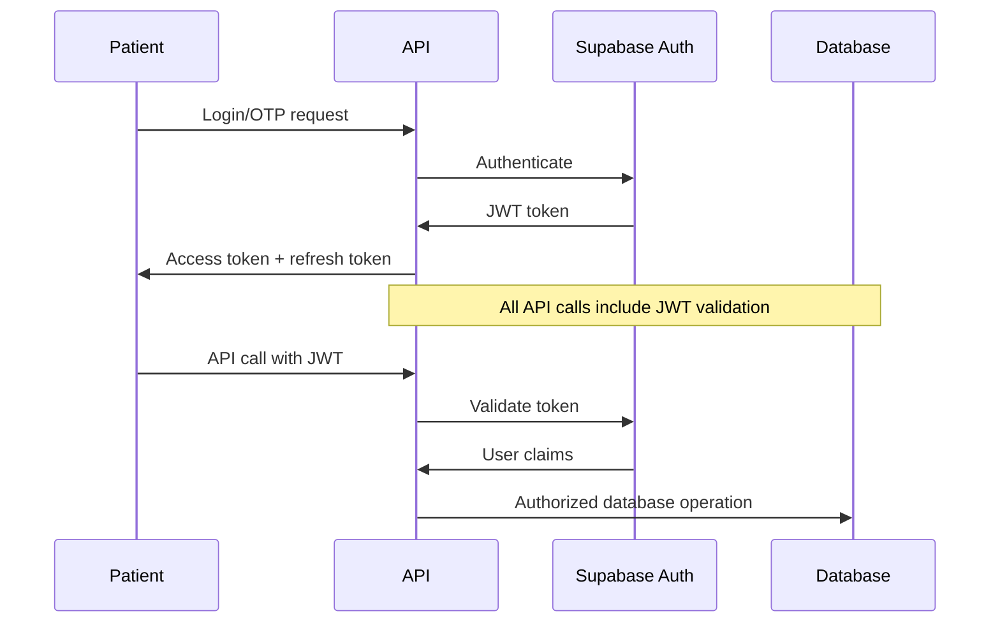

# GP Referral System - Technical Architecture Specification
VERSION: 1.0
CREATED: 2025-08-22
PURPOSE: Technical architecture specification for Swiss GP referral system backend implementation

## 1. Architecture Overview

### System Components


### Technology Stack
- **Backend Framework**: Supabase Edge Functions (Deno/TypeScript)
- **Database**: PostgreSQL (Supabase)
- **Authentication**: Supabase Auth with JWT
- **File Storage**: Supabase Storage with encryption
- **Queue System**: Supabase Functions with webhook triggers
- **Cache**: Redis (for rate limiting and sessions)
- **Email**: SendGrid/Postmark with templates
- **SMS**: Twilio/MessageBird
- **PDF Generation**: jsPDF/Puppeteer
- **QR Codes**: qrcode.js library

## 2. Database Architecture

### Core Tables
```sql
-- Enhanced GP referrals table (from existing schema)
CREATE TABLE public.gp_referrals (
    id UUID PRIMARY KEY DEFAULT uuid_generate_v4(),
    user_id UUID REFERENCES public.user_profiles(id) ON DELETE CASCADE,
    questionnaire_id UUID REFERENCES public.eligibility_questionnaires(id),
    
    -- Access codes
    qr_code_data TEXT NOT NULL UNIQUE,
    access_code VARCHAR(6) NOT NULL UNIQUE,
    access_code_hash TEXT NOT NULL, -- bcrypt hashed
    
    -- GP details
    gp_name TEXT,
    gp_practice TEXT,
    gp_email TEXT,
    gp_phone TEXT,
    gp_hin_number VARCHAR(10), -- Swiss HIN number
    
    -- Referral content
    clinical_summary JSONB NOT NULL,
    patient_data JSONB NOT NULL, -- Encrypted patient info
    
    -- Status and tracking
    status referral_status_enum DEFAULT 'draft',
    created_at TIMESTAMPTZ DEFAULT CURRENT_TIMESTAMP,
    expires_at TIMESTAMPTZ DEFAULT (CURRENT_TIMESTAMP + INTERVAL '30 days'),
    accessed_at TIMESTAMPTZ,
    access_count INTEGER DEFAULT 0,
    
    -- Documents
    referral_pdf_path TEXT,
    gp_response_data JSONB,
    
    -- Security and audit
    creation_ip INET,
    access_ips INET[],
    audit_log JSONB DEFAULT '[]'::jsonb,
    
    updated_at TIMESTAMPTZ DEFAULT CURRENT_TIMESTAMP
);

-- Referral access logs for security
CREATE TABLE public.referral_access_logs (
    id UUID PRIMARY KEY DEFAULT uuid_generate_v4(),
    referral_id UUID REFERENCES public.gp_referrals(id) ON DELETE CASCADE,
    
    -- Access details
    access_method TEXT CHECK (access_method IN ('qr_code', 'manual_code')),
    doctor_info JSONB, -- HIN, email, practice
    
    -- Security
    ip_address INET,
    user_agent TEXT,
    success BOOLEAN,
    failure_reason TEXT,
    
    -- Compliance
    gdpr_consent BOOLEAN DEFAULT FALSE,
    data_retention_acknowledged BOOLEAN DEFAULT FALSE,
    
    accessed_at TIMESTAMPTZ DEFAULT CURRENT_TIMESTAMP
);

-- Rate limiting table
CREATE TABLE public.rate_limits (
    id UUID PRIMARY KEY DEFAULT uuid_generate_v4(),
    resource_key TEXT NOT NULL, -- IP, user_id, etc.
    resource_type TEXT NOT NULL, -- 'otp', 'referral_access', etc.
    attempt_count INTEGER DEFAULT 0,
    window_start TIMESTAMPTZ DEFAULT CURRENT_TIMESTAMP,
    blocked_until TIMESTAMPTZ,
    
    UNIQUE(resource_key, resource_type)
);
```

### Indexes and Performance
```sql
-- Critical indexes for performance
CREATE INDEX idx_gp_referrals_access_code ON public.gp_referrals(access_code);
CREATE INDEX idx_gp_referrals_qr_code ON public.gp_referrals(qr_code_data);
CREATE INDEX idx_gp_referrals_status ON public.gp_referrals(status);
CREATE INDEX idx_gp_referrals_expires_at ON public.gp_referrals(expires_at);

CREATE INDEX idx_access_logs_referral ON public.referral_access_logs(referral_id);
CREATE INDEX idx_access_logs_doctor ON public.referral_access_logs((doctor_info->>'hin_number'));

CREATE INDEX idx_rate_limits_resource ON public.rate_limits(resource_key, resource_type);
CREATE INDEX idx_rate_limits_window ON public.rate_limits(window_start, resource_type);
```

## 3. Security Architecture

### Authentication Flow


### Rate Limiting Implementation
```typescript
// Rate limiting middleware
export const rateLimitMiddleware = async (
  request: Request,
  limits: {
    maxAttempts: number;
    windowMs: number;
    blockDurationMs: number;
  }
): Promise<{allowed: boolean, retryAfter?: number}> => {
  const clientId = getClientIdentifier(request); // IP + user ID
  const resourceType = getResourceType(request.url);
  
  const { data: rateLimit } = await supabase
    .from('rate_limits')
    .select('*')
    .eq('resource_key', clientId)
    .eq('resource_type', resourceType)
    .single();
    
  if (!rateLimit) {
    // First request - create rate limit record
    await supabase.from('rate_limits').insert({
      resource_key: clientId,
      resource_type: resourceType,
      attempt_count: 1
    });
    return { allowed: true };
  }
  
  const now = new Date();
  const windowStart = new Date(rateLimit.window_start);
  const windowAge = now.getTime() - windowStart.getTime();
  
  // Check if blocked
  if (rateLimit.blocked_until && new Date(rateLimit.blocked_until) > now) {
    return {
      allowed: false,
      retryAfter: Math.ceil((new Date(rateLimit.blocked_until).getTime() - now.getTime()) / 1000)
    };
  }
  
  // Reset window if expired
  if (windowAge > limits.windowMs) {
    await supabase.from('rate_limits').update({
      attempt_count: 1,
      window_start: now.toISOString(),
      blocked_until: null
    }).eq('id', rateLimit.id);
    return { allowed: true };
  }
  
  // Check if limit exceeded
  if (rateLimit.attempt_count >= limits.maxAttempts) {
    await supabase.from('rate_limits').update({
      blocked_until: new Date(now.getTime() + limits.blockDurationMs).toISOString()
    }).eq('id', rateLimit.id);
    return { allowed: false, retryAfter: Math.ceil(limits.blockDurationMs / 1000) };
  }
  
  // Increment attempt count
  await supabase.from('rate_limits').update({
    attempt_count: rateLimit.attempt_count + 1
  }).eq('id', rateLimit.id);
  
  return { allowed: true };
};
```

### Encryption Implementation
```typescript
// Sensitive data encryption
import { createCipher, createDecipher } from 'crypto';

export class DataEncryption {
  private static readonly ALGORITHM = 'aes-256-gcm';
  private static readonly KEY = Deno.env.get('ENCRYPTION_KEY')!;
  
  static encrypt(data: any): string {
    const cipher = createCipher(this.ALGORITHM, this.KEY);
    const jsonData = JSON.stringify(data);
    let encrypted = cipher.update(jsonData, 'utf8', 'hex');
    encrypted += cipher.final('hex');
    const authTag = cipher.getAuthTag().toString('hex');
    return `${encrypted}:${authTag}`;
  }
  
  static decrypt(encryptedData: string): any {
    const [encrypted, authTag] = encryptedData.split(':');
    const decipher = createDecipher(this.ALGORITHM, this.KEY);
    decipher.setAuthTag(Buffer.from(authTag, 'hex'));
    let decrypted = decipher.update(encrypted, 'hex', 'utf8');
    decrypted += decipher.final('utf8');
    return JSON.parse(decrypted);
  }
}
```

## 4. API Implementation Patterns

### Request Validation with Zod
```typescript
import { z } from 'zod';

// Swiss-specific validation schemas
export const SwissPhoneSchema = z.string().regex(/^\+41[0-9]{9}$/, 'Invalid Swiss phone number');
export const SwissHINSchema = z.string().regex(/^HIN[0-9]{7}$/, 'Invalid HIN number');
export const SwissCantonSchema = z.enum(['AG', 'AI', 'AR', 'BE', 'BL', 'BS', 'FR', 'GE', 'GL', 'GR', 'JU', 'LU', 'NE', 'NW', 'OW', 'SG', 'SH', 'SO', 'SZ', 'TG', 'TI', 'UR', 'VD', 'VS', 'ZG', 'ZH']);

export const ReferralGenerationSchema = z.object({
  userId: z.string().uuid(),
  clinicalSummary: z.object({
    symptoms: z.array(z.string()).min(1),
    riskFactors: z.array(z.string()),
    medications: z.array(z.string()).default([]),
    medicalHistory: z.string().optional(),
    eligibilityScore: z.number().min(0).max(100)
  }),
  deliveryMethod: z.object({
    email: z.string().email().optional(),
    phone: SwissPhoneSchema.optional(),
    generatePDF: z.boolean().default(true)
  }).refine(data => data.email || data.phone, 'Either email or phone required'),
  gpPreferences: z.object({
    preferredLanguage: z.enum(['de', 'fr', 'it', 'en']).default('de'),
    includeDiagnosticRecommendations: z.boolean().default(true)
  }).optional()
});

export const DoctorValidationSchema = z.object({
  accessCode: z.string().min(6),
  doctorCredentials: z.object({
    hinNumber: SwissHINSchema.optional(),
    email: z.string().email(),
    practiceName: z.string().min(1)
  })
});
```

### Error Handling and Logging
```typescript
export interface APIError {
  code: string;
  message: string;
  details?: any;
  statusCode: number;
}

export class APIErrorHandler {
  static create(code: string, message: string, statusCode: number = 400, details?: any): APIError {
    return { code, message, statusCode, details };
  }
  
  static validation(errors: any[]): APIError {
    return this.create('VALIDATION_ERROR', 'Request validation failed', 400, { errors });
  }
  
  static authentication(): APIError {
    return this.create('AUTHENTICATION_ERROR', 'Invalid or missing authentication', 401);
  }
  
  static rateLimited(retryAfter?: number): APIError {
    return this.create('RATE_LIMITED', 'Too many requests', 429, { retryAfter });
  }
  
  static notFound(resource: string): APIError {
    return this.create('NOT_FOUND', `${resource} not found`, 404);
  }
}

// Structured logging with Swiss compliance
export const logger = {
  info: (message: string, data?: any) => {
    console.log(JSON.stringify({
      level: 'info',
      timestamp: new Date().toISOString(),
      message,
      data: sanitizeForLogs(data)
    }));
  },
  
  error: (message: string, error?: any, data?: any) => {
    console.error(JSON.stringify({
      level: 'error',
      timestamp: new Date().toISOString(),
      message,
      error: error instanceof Error ? error.message : error,
      data: sanitizeForLogs(data)
    }));
  },
  
  audit: (action: string, userId?: string, data?: any) => {
    console.log(JSON.stringify({
      level: 'audit',
      timestamp: new Date().toISOString(),
      action,
      userId,
      data: sanitizeForLogs(data)
    }));
  }
};

function sanitizeForLogs(data: any): any {
  if (!data) return data;
  const sensitiveFields = ['password', 'token', 'ssn', 'hin_number', 'access_code'];
  const sanitized = { ...data };
  
  for (const field of sensitiveFields) {
    if (field in sanitized) {
      sanitized[field] = '[REDACTED]';
    }
  }
  
  return sanitized;
}
```

## 5. Service Layer Architecture

### Referral Service
```typescript
export class ReferralService {
  private supabase = createClient(/* config */);
  
  async generateReferral(request: ReferralGenerationRequest): Promise<ReferralGenerationResponse> {
    logger.audit('REFERRAL_GENERATION_STARTED', request.userId);
    
    try {
      // Generate secure codes
      const accessCode = this.generateAccessCode();
      const qrCodeData = this.generateQRCodeData(request.userId, accessCode);
      
      // Create referral record
      const { data: referral, error } = await this.supabase
        .from('gp_referrals')
        .insert({
          user_id: request.userId,
          qr_code_data: qrCodeData,
          access_code: accessCode,
          access_code_hash: await bcrypt.hash(accessCode, 12),
          clinical_summary: request.clinicalSummary,
          patient_data: DataEncryption.encrypt({
            userId: request.userId,
            deliveryMethod: request.deliveryMethod
          }),
          creation_ip: this.getClientIP()
        })
        .select()
        .single();
        
      if (error) throw error;
      
      // Generate QR code image
      const qrCodeImage = await QRCode.toDataURL(qrCodeData, {
        errorCorrectionLevel: 'H',
        width: 256,
        margin: 2
      });
      
      // Generate PDF if requested
      let pdfUrl = null;
      if (request.deliveryMethod.generatePDF) {
        pdfUrl = await this.generateReferralPDF(referral);
      }
      
      // Send notifications
      const deliveryStatus = await this.sendReferralNotifications(
        request.deliveryMethod,
        referral.access_code,
        qrCodeImage,
        pdfUrl
      );
      
      logger.audit('REFERRAL_GENERATED', request.userId, { referralId: referral.id });
      
      return {
        data: {
          referralId: referral.id,
          qrCode: qrCodeImage,
          accessCode: accessCode,
          pdfUrl,
          expiresAt: referral.expires_at,
          deliveryStatus
        },
        meta: {
          timestamp: new Date().toISOString(),
          version: '1.0',
          requestId: crypto.randomUUID()
        }
      };
      
    } catch (error) {
      logger.error('REFERRAL_GENERATION_FAILED', error, { userId: request.userId });
      throw error;
    }
  }
  
  async validateReferralAccess(request: ReferralValidationRequest): Promise<ReferralValidationResponse> {
    // Rate limiting
    const rateLimitResult = await rateLimitMiddleware(this.request, {
      maxAttempts: 5,
      windowMs: 15 * 60 * 1000, // 15 minutes
      blockDurationMs: 60 * 60 * 1000 // 1 hour
    });
    
    if (!rateLimitResult.allowed) {
      throw APIErrorHandler.rateLimited(rateLimitResult.retryAfter);
    }
    
    try {
      // Find referral by access code or QR data
      const { data: referral, error } = await this.supabase
        .from('gp_referrals')
        .select('*')
        .or(`access_code.eq.${request.accessCode},qr_code_data.eq.${request.accessCode}`)
        .single();
        
      if (error || !referral) {
        // Log failed access attempt
        await this.logAccessAttempt(null, request.doctorCredentials, false, 'Invalid access code');
        throw APIErrorHandler.notFound('Referral');
      }
      
      // Check expiration
      if (new Date() > new Date(referral.expires_at)) {
        await this.logAccessAttempt(referral.id, request.doctorCredentials, false, 'Expired referral');
        throw APIErrorHandler.create('REFERRAL_EXPIRED', 'Referral has expired', 410);
      }
      
      // Verify access code if using 6-digit code
      if (request.accessCode.length === 6) {
        const isValid = await bcrypt.compare(request.accessCode, referral.access_code_hash);
        if (!isValid) {
          await this.logAccessAttempt(referral.id, request.doctorCredentials, false, 'Invalid access code');
          throw APIErrorHandler.create('INVALID_ACCESS_CODE', 'Invalid access code', 401);
        }
      }
      
      // Verify doctor credentials (optional HIN verification)
      if (request.doctorCredentials.hinNumber) {
        const hinValid = await this.verifyHINNumber(request.doctorCredentials.hinNumber);
        if (!hinValid) {
          await this.logAccessAttempt(referral.id, request.doctorCredentials, false, 'Invalid HIN number');
          throw APIErrorHandler.create('INVALID_HIN', 'Invalid HIN credentials', 401);
        }
      }
      
      // Update access tracking
      await this.supabase
        .from('gp_referrals')
        .update({
          accessed_at: new Date().toISOString(),
          access_count: (referral.access_count || 0) + 1,
          access_ips: [...(referral.access_ips || []), this.getClientIP()]
        })
        .eq('id', referral.id);
      
      // Log successful access
      await this.logAccessAttempt(referral.id, request.doctorCredentials, true);
      
      // Generate access token for further operations
      const accessToken = await this.generateDoctorAccessToken(referral.id, request.doctorCredentials);
      
      // Decrypt patient info for response
      const patientData = DataEncryption.decrypt(referral.patient_data);
      
      logger.audit('REFERRAL_ACCESSED', patientData.userId, {
        referralId: referral.id,
        doctorHIN: request.doctorCredentials.hinNumber
      });
      
      return {
        data: {
          valid: true,
          referralId: referral.id,
          patientInfo: {
            initials: this.getPatientInitials(patientData),
            dateOfBirth: this.partialDateOfBirth(patientData.dateOfBirth),
            gender: patientData.gender
          },
          accessToken,
          expiresIn: 3600 // 1 hour
        },
        meta: {
          timestamp: new Date().toISOString(),
          version: '1.0',
          requestId: crypto.randomUUID()
        }
      };
      
    } catch (error) {
      logger.error('REFERRAL_VALIDATION_FAILED', error, request.doctorCredentials);
      throw error;
    }
  }
  
  private generateAccessCode(): string {
    return Math.floor(100000 + Math.random() * 900000).toString();
  }
  
  private generateQRCodeData(userId: string, accessCode: string): string {
    return `SKIIN:${userId}:${accessCode}:${Date.now()}`;
  }
  
  private async verifyHINNumber(hinNumber: string): Promise<boolean> {
    // Integration with Swiss HIN verification service
    // This would typically call an external API
    return hinNumber.match(/^HIN[0-9]{7}$/) !== null;
  }
}
```

## 6. Communication Services

### Multi-Channel Delivery
```typescript
export class CommunicationService {
  private emailProvider = new EmailProvider();
  private smsProvider = new SMSProvider();
  
  async sendReferralPackage(
    deliveryMethod: DeliveryMethod,
    accessCode: string,
    qrCodeImage: string,
    pdfUrl?: string
  ): Promise<DeliveryStatus> {
    const results: DeliveryStatus = {
      email: 'not_requested',
      sms: 'not_requested'
    };
    
    // Email delivery
    if (deliveryMethod.email) {
      try {
        await this.emailProvider.sendTemplatedEmail({
          to: deliveryMethod.email,
          template: 'gp_referral_package',
          data: {
            accessCode,
            qrCodeImage,
            pdfUrl,
            expiresAt: new Date(Date.now() + 30 * 24 * 60 * 60 * 1000).toLocaleDateString()
          }
        });
        results.email = 'sent';
      } catch (error) {
        logger.error('EMAIL_DELIVERY_FAILED', error);
        results.email = 'failed';
      }
    }
    
    // SMS delivery
    if (deliveryMethod.phone) {
      try {
        const message = `Your SKIIN GP referral code: ${accessCode}. Show this to your doctor. Valid for 30 days. ${pdfUrl ? `Download: ${pdfUrl}` : ''}`;
        
        await this.smsProvider.sendSMS({
          to: deliveryMethod.phone,
          message
        });
        results.sms = 'sent';
      } catch (error) {
        logger.error('SMS_DELIVERY_FAILED', error);
        results.sms = 'failed';
      }
    }
    
    return results;
  }
}

// Email templates for different languages
export const EmailTemplates = {
  gp_referral_package: {
    de: {
      subject: 'Ihre SKIIN Arztüberweisung ist bereit',
      html: `
        <h2>Ihre SKIIN Herzüberweisung</h2>
        <p>Ihr 6-stelliger Zugangs-Code: <strong>{{accessCode}}</strong></p>
        <p>QR-Code:</p>
        
        <p>Diese Überweisung ist gültig bis: {{expiresAt}}</p>
        {{#if pdfUrl}}<p><a href="{{pdfUrl}}">PDF herunterladen</a></p>{{/if}}
      `
    },
    fr: {
      subject: 'Votre référence médicale SKIIN est prête',
      html: `
        <h2>Votre référence cardiaque SKIIN</h2>
        <p>Votre code d'accès à 6 chiffres: <strong>{{accessCode}}</strong></p>
        <p>Code QR:</p>
        
        <p>Cette référence est valide jusqu'au: {{expiresAt}}</p>
        {{#if pdfUrl}}<p><a href="{{pdfUrl}}">Télécharger le PDF</a></p>{{/if}}
      `
    },
    it: {
      subject: 'Il suo riferimento medico SKIIN è pronto',
      html: `
        <h2>Il suo riferimento cardiaco SKIIN</h2>
        <p>Il suo codice di accesso a 6 cifre: <strong>{{accessCode}}</strong></p>
        <p>Codice QR:</p>
        
        <p>Questo riferimento è valido fino al: {{expiresAt}}</p>
        {{#if pdfUrl}}<p><a href="{{pdfUrl}}">Scarica PDF</a></p>{{/if}}
      `
    }
  }
};
```

## 7. Performance Requirements

### Response Time Targets
- **Referral Generation**: < 2 seconds (including PDF generation)
- **Code Validation**: < 200ms
- **Referral Details**: < 500ms
- **Document Upload**: < 5 seconds (50MB max)

### Scalability Requirements
- **Concurrent Users**: 1000+ simultaneous referral generations
- **Database Connections**: Connection pooling with max 100 connections
- **File Storage**: 10TB initial capacity with auto-scaling
- **Cache**: Redis cluster for rate limiting (100k+ operations/sec)

### Monitoring and Alerting
```typescript
// Performance monitoring middleware
export const performanceMonitor = (endpoint: string) => {
  return async (request: Request, next: () => Promise<Response>) => {
    const startTime = performance.now();
    
    try {
      const response = await next();
      const endTime = performance.now();
      const duration = endTime - startTime;
      
      // Log performance metrics
      logger.info('PERFORMANCE_METRIC', {
        endpoint,
        duration,
        status: response.status,
        timestamp: new Date().toISOString()
      });
      
      // Alert if slow
      if (duration > 2000) {
        logger.error('SLOW_RESPONSE_ALERT', null, {
          endpoint,
          duration,
          threshold: 2000
        });
      }
      
      return response;
    } catch (error) {
      const endTime = performance.now();
      logger.error('ENDPOINT_ERROR', error, {
        endpoint,
        duration: endTime - startTime
      });
      throw error;
    }
  };
};
```

## 8. Testing Strategy

### Test Coverage Requirements
- **Unit Tests**: 90% coverage for service functions
- **Integration Tests**: All API endpoints
- **Security Tests**: Authentication, authorization, rate limiting
- **Performance Tests**: Load testing up to 10x expected traffic

### Test Implementation
```typescript
// Integration test example
import { assertEquals, assertExists } from 'https://deno.land/std/testing/asserts.ts';

Deno.test('GP Referral Generation - Success Flow', async () => {
  const request: ReferralGenerationRequest = {
    userId: crypto.randomUUID(),
    clinicalSummary: {
      symptoms: ['chest_pain', 'shortness_of_breath'],
      riskFactors: ['hypertension'],
      medications: ['lisinopril'],
      eligibilityScore: 75
    },
    deliveryMethod: {
      email: 'test@example.com',
      generatePDF: true
    }
  };
  
  const response = await fetch('http://localhost:3000/api/referrals/generate', {
    method: 'POST',
    headers: {
      'Content-Type': 'application/json',
      'Authorization': `Bearer ${await getTestJWT()}`
    },
    body: JSON.stringify(request)
  });
  
  assertEquals(response.status, 201);
  
  const result = await response.json();
  assertExists(result.data.referralId);
  assertExists(result.data.qrCode);
  assertEquals(result.data.accessCode.length, 6);
  assertExists(result.data.pdfUrl);
});

// Load testing script
import { check, sleep } from 'k6';
import http from 'k6/http';

export const options = {
  stages: [
    { duration: '2m', target: 100 },
    { duration: '5m', target: 100 },
    { duration: '2m', target: 200 },
    { duration: '5m', target: 200 },
    { duration: '2m', target: 0 },
  ],
};

export default function () {
  const payload = JSON.stringify({
    userId: uuidv4(),
    clinicalSummary: {
      symptoms: ['chest_pain'],
      riskFactors: ['age_over_50'],
      medications: [],
      eligibilityScore: 60
    },
    deliveryMethod: {
      email: 'test@example.com'
    }
  });
  
  const response = http.post('http://localhost:3000/api/referrals/generate', payload, {
    headers: {
      'Content-Type': 'application/json',
      'Authorization': `Bearer ${getToken()}`
    },
  });
  
  check(response, {
    'status is 201': (r) => r.status === 201,
    'response time < 2000ms': (r) => r.timings.duration < 2000,
  });
  
  sleep(1);
}
```

## 9. Deployment Architecture

### Infrastructure Requirements
```yaml
# docker-compose.yml for development
version: '3.8'
services:
  api:
    build: .
    ports:
      - "3000:3000"
    environment:
      - SUPABASE_URL=${SUPABASE_URL}
      - SUPABASE_ANON_KEY=${SUPABASE_ANON_KEY}
      - ENCRYPTION_KEY=${ENCRYPTION_KEY}
    depends_on:
      - redis
      
  redis:
    image: redis:7-alpine
    ports:
      - "6379:6379"
    volumes:
      - redis_data:/data
      
  nginx:
    image: nginx:alpine
    ports:
      - "80:80"
      - "443:443"
    volumes:
      - ./nginx.conf:/etc/nginx/nginx.conf
      - ./ssl:/etc/ssl/certs

volumes:
  redis_data:
```

### Environment Configuration
```bash
# Production environment variables
SUPABASE_URL=https://your-project.supabase.co
SUPABASE_ANON_KEY=your-anon-key
SUPABASE_SERVICE_KEY=your-service-key
ENCRYPTION_KEY=your-256-bit-encryption-key

# Email/SMS providers
SENDGRID_API_KEY=your-sendgrid-key
TWILIO_ACCOUNT_SID=your-twilio-sid
TWILIO_AUTH_TOKEN=your-twilio-token

# Swiss integrations
HIN_API_ENDPOINT=https://hin-api.ch
HIN_API_KEY=your-hin-api-key

# Security
JWT_SECRET=your-jwt-secret
RATE_LIMIT_REDIS_URL=redis://localhost:6379

# Monitoring
SENTRY_DSN=your-sentry-dsn
LOG_LEVEL=info
```

This comprehensive technical architecture specification provides the foundation for implementing a secure, scalable, and compliant GP referral system that meets Swiss healthcare regulations and performance requirements.