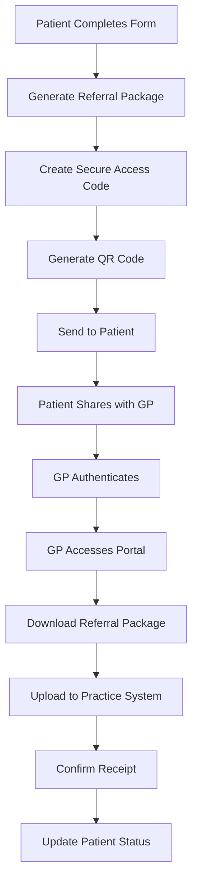

# GP Referral System Best Practices for Digital Health
VERSION: 1.0.0
CREATED: 2025-08-22
PURPOSE: Comprehensive guide for implementing secure GP referral systems in digital health platforms

## Executive Summary

This document provides authoritative best practices for implementing GP referral systems in digital health platforms, with specific attention to Swiss healthcare requirements, security standards, and compliance regulations. Based on research from NHS e-Referral Service, HIPAA/GDPR requirements, and industry standards.

## 1. GP Referral Package Standards

### 1.1 Essential Information Requirements

Based on NHS e-Referral Service and international standards, a complete GP referral package must include:

#### **Patient Information**
- Full name and date of birth
- Contact details (phone, email, address)
- Insurance/NHS number or equivalent identifier
- Preferred language for communication
- Emergency contact information

#### **Clinical Information**
- Chief complaint/reason for referral
- Medical history summary
- Current medications list
- Known allergies and adverse reactions
- Recent test results (if applicable)
- Vital signs at time of referral

#### **Referral Details**
- Referring physician name and credentials
- Referring practice contact information
- Date of referral
- Urgency level (routine, urgent, emergency)
- Specific specialist or service requested
- Clinical question to be addressed

#### **Administrative Information**
- Insurance coverage details
- Consent for information sharing
- Preferred appointment times
- Special requirements (accessibility, interpreter)

### 1.2 Standard Document Formats

#### **Preferred Formats**
1. **PDF/A** - Long-term archival standard
   - ISO 19005 compliant
   - Self-contained with embedded fonts
   - Digitally signed for authenticity

2. **HL7 FHIR DocumentReference**
   - Structured data format
   - Interoperable between systems
   - Machine-readable and processable

3. **CDA (Clinical Document Architecture)**
   - HL7 standard for clinical documents
   - XML-based structure
   - Human and machine readable

#### **Document Structure Template**
```
1. Header Section
   - Document ID and version
   - Creation date/time
   - Author information
   - Document type classification

2. Patient Demographics
   - Identification details
   - Contact information
   - Insurance/coverage

3. Clinical Summary
   - Reason for referral
   - Medical history
   - Current medications
   - Allergies

4. Referral Request
   - Requested service/specialist
   - Urgency level
   - Clinical questions

5. Attachments
   - Test results
   - Imaging reports
   - Previous consultation notes
```

### 1.3 QR Code Best Practices

#### **Implementation Standards**
- **QR Code Type**: Use QR Code Model 2 (ISO/IEC 18004)
- **Error Correction Level**: Level H (30% damage tolerance)
- **Data Capacity**: Maximum 200 characters for URL
- **Minimum Size**: 2cm x 2cm for print, 200x200 pixels digital

#### **Security Considerations**
1. **Never embed PHI directly** in QR codes
2. Use secure URLs with HTTPS only
3. Implement time-limited access tokens
4. Include audit logging for all QR code scans
5. Use signed URLs to prevent tampering

#### **Recommended QR Code Content Structure**
```json
{
  "type": "medical_referral",
  "url": "https://secure.domain.com/referral/",
  "token": "time-limited-access-token",
  "expires": "2025-08-23T10:00:00Z",
  "verification": "digital-signature"
}
```

## 2. Secure Code Generation Patterns

### 2.1 6-Digit Code Generation Algorithms

#### **Cryptographically Secure Generation**
```javascript
// Best Practice: Use crypto.randomInt for secure random generation
import { randomInt } from 'crypto';

function generateSecureOTP(): string {
  // Generate number between 100000 and 999999
  const otp = randomInt(100000, 1000000);
  return otp.toString();
}

// Alternative: Using crypto.randomBytes
function generateSecureOTPBytes(): string {
  const bytes = crypto.randomBytes(3);
  const number = bytes.readUIntBE(0, 3);
  const otp = (number % 900000) + 100000;
  return otp.toString();
}
```

#### **Security Requirements**
1. **Entropy Source**: Use cryptographically secure random number generator
2. **Uniqueness**: Check against recently used codes (last 24 hours)
3. **Format**: Always 6 digits (100000-999999)
4. **Character Set**: Numeric only for universal accessibility
5. **Storage**: Hash codes using bcrypt/scrypt before storage

### 2.2 Code Expiration Strategies

#### **Recommended Expiration Times**
- **High Security (Financial/Medical)**: 5 minutes
- **Standard Security**: 10 minutes
- **Low Security (Marketing)**: 30 minutes
- **Swiss Healthcare Standard**: 15 minutes (based on common practice)

#### **Implementation Pattern**
```javascript
interface OTPConfig {
  expirationMinutes: number;
  maxAttempts: number;
  cooldownMinutes: number;
  cleanupIntervalHours: number;
}

const HEALTHCARE_OTP_CONFIG: OTPConfig = {
  expirationMinutes: 15,
  maxAttempts: 3,
  cooldownMinutes: 30,
  cleanupIntervalHours: 24
};
```

### 2.3 Security Considerations

#### **Storage Security**
1. **Never store plain text OTPs**
2. Use bcrypt with cost factor ≥ 12
3. Implement rate limiting (max 3 attempts)
4. Add progressive delays after failed attempts
5. Store attempt history for audit

#### **Transmission Security**
1. Use SMS and Email dual-channel when possible
2. Implement TLS 1.3 for all communications
3. Add message encryption for email delivery
4. Include anti-phishing warnings

## 3. Doctor Portal Requirements

### 3.1 Authentication Patterns for Medical Professionals

#### **Multi-Factor Authentication (MFA)**
Based on HIPAA and Swiss medical standards:

1. **Primary Factor**: Username/password
   - Minimum 12 characters
   - Complexity requirements
   - 90-day rotation policy

2. **Secondary Factor Options**:
   - FIDO2/WebAuthn hardware keys (preferred)
   - TOTP apps (Google Authenticator, Authy)
   - SMS OTP (backup only)
   - Biometric (for mobile apps)

3. **Professional Verification**:
   - Medical license number validation
   - Swiss MedReg registration check
   - Practice affiliation verification

#### **Session Management**
```javascript
const MEDICAL_SESSION_CONFIG = {
  idleTimeout: 15, // minutes
  absoluteTimeout: 480, // 8 hours
  warningBefore: 2, // minutes
  requireReauthFor: ['patientData', 'prescriptions', 'referrals']
};
```

### 3.2 File Upload Security Standards

#### **File Validation Requirements**
1. **File Type Restrictions**:
   - Allowed: PDF, JPEG, PNG, DICOM
   - Prohibited: Executables, scripts, archives

2. **Size Limits**:
   - Single file: 25MB
   - Total per referral: 100MB
   - Image resolution: Max 4096x4096

3. **Content Scanning**:
   - Antivirus scanning (ClamAV or similar)
   - MIME type verification
   - Magic number validation
   - PDF malware detection

#### **Secure Upload Implementation**
```javascript
interface SecureUploadConfig {
  allowedMimeTypes: string[];
  maxFileSize: number;
  scanForMalware: boolean;
  encryptAtRest: boolean;
  signedUrlExpiration: number;
}

const MEDICAL_UPLOAD_CONFIG: SecureUploadConfig = {
  allowedMimeTypes: [
    'application/pdf',
    'image/jpeg',
    'image/png',
    'application/dicom'
  ],
  maxFileSize: 25 * 1024 * 1024, // 25MB
  scanForMalware: true,
  encryptAtRest: true,
  signedUrlExpiration: 3600 // 1 hour
};
```

### 3.3 GDPR/HIPAA Compliance Requirements

#### **Data Protection Measures**

1. **Encryption Standards**:
   - At rest: AES-256
   - In transit: TLS 1.3
   - Key management: Hardware Security Module (HSM)

2. **Access Controls**:
   - Role-based access control (RBAC)
   - Principle of least privilege
   - Audit logging for all access
   - Regular access reviews

3. **Data Retention**:
   - Active referrals: Until completed + 30 days
   - Completed referrals: 7 years (Swiss requirement)
   - Audit logs: 3 years minimum
   - Automated deletion after retention period

4. **Patient Rights (GDPR)**:
   - Right to access (within 30 days)
   - Right to rectification
   - Right to erasure (with medical exceptions)
   - Right to data portability
   - Consent management system

## 4. Swiss Healthcare Specific Requirements

### 4.1 Legal Requirements for GP Referrals

#### **Swiss Medical Regulations**
1. **No mandatory GP registration** - Patients have free choice
2. **Referral not always required** - Direct specialist access allowed
3. **Insurance considerations** - Some plans require GP referral for coverage
4. **Language requirements** - Must support German, French, Italian, Romansh

#### **Documentation Standards**
1. **Federal Law on Health Insurance (KVG/LAMal)**:
   - Standardized billing codes
   - Clear medical necessity documentation
   - Insurance pre-authorization when required

2. **Swiss Medical Association (FMH) Standards**:
   - 80 hours annual training requirement
   - Professional code compliance
   - Telemedicine guidelines adherence

### 4.2 Data Sovereignty Requirements

1. **Data Location**: Must be stored in Switzerland or EU
2. **Cross-border Transfer**: Requires explicit consent
3. **Backup Requirements**: Swiss-based backup mandatory
4. **Audit Requirements**: Federal Data Protection Act compliance

### 4.3 Integration with Swiss Systems

#### **Key Integration Points**
1. **MedReg**: Physician verification
2. **Swiss Post eHealth**: Secure messaging
3. **Insurance Systems**: Coverage verification
4. **Hospital Information Systems**: Interoperability

## 5. Implementation Patterns

### 5.1 Referral Workflow Architecture



### 5.2 Security Architecture

```javascript
// Comprehensive Security Layer Implementation
class ReferralSecurityManager {
  // Encryption
  private encryptionKey: Buffer;
  private signingKey: Buffer;
  
  // Rate Limiting
  private rateLimiter: RateLimiter;
  
  // Audit
  private auditLogger: AuditLogger;
  
  async createSecureReferral(data: ReferralData): Promise<SecureReferral> {
    // 1. Validate input
    this.validateReferralData(data);
    
    // 2. Encrypt sensitive data
    const encrypted = await this.encrypt(data);
    
    // 3. Generate access code
    const accessCode = this.generateAccessCode();
    
    // 4. Create time-limited token
    const token = this.createToken(encrypted.id, accessCode);
    
    // 5. Generate QR code
    const qrCode = this.generateQRCode(token);
    
    // 6. Audit log
    await this.auditLogger.log('REFERRAL_CREATED', {
      referralId: encrypted.id,
      timestamp: new Date()
    });
    
    return {
      id: encrypted.id,
      accessCode,
      qrCode,
      expiresAt: new Date(Date.now() + 15 * 60 * 1000)
    };
  }
}
```

### 5.3 Database Schema Pattern

```sql
-- Core referral tables with security and compliance
CREATE TABLE referrals (
  id UUID PRIMARY KEY DEFAULT gen_random_uuid(),
  patient_id UUID NOT NULL REFERENCES patients(id),
  referring_physician_id UUID NOT NULL REFERENCES physicians(id),
  
  -- Encrypted data
  encrypted_clinical_data BYTEA NOT NULL,
  encryption_key_id VARCHAR(255) NOT NULL,
  
  -- Access control
  access_code_hash VARCHAR(255) NOT NULL,
  access_attempts INTEGER DEFAULT 0,
  locked_until TIMESTAMP,
  
  -- Compliance
  consent_given BOOLEAN NOT NULL,
  consent_timestamp TIMESTAMP NOT NULL,
  data_retention_until DATE NOT NULL,
  
  -- Audit
  created_at TIMESTAMP NOT NULL DEFAULT NOW(),
  accessed_at TIMESTAMP,
  accessed_by UUID REFERENCES physicians(id),
  
  -- Status
  status VARCHAR(50) NOT NULL DEFAULT 'pending',
  expires_at TIMESTAMP NOT NULL
);

-- Audit trail
CREATE TABLE referral_audit_log (
  id UUID PRIMARY KEY DEFAULT gen_random_uuid(),
  referral_id UUID NOT NULL REFERENCES referrals(id),
  action VARCHAR(100) NOT NULL,
  actor_id UUID NOT NULL,
  actor_type VARCHAR(50) NOT NULL,
  ip_address INET,
  user_agent TEXT,
  details JSONB,
  created_at TIMESTAMP NOT NULL DEFAULT NOW()
);

-- Row Level Security
ALTER TABLE referrals ENABLE ROW LEVEL SECURITY;

CREATE POLICY referral_patient_access ON referrals
  FOR SELECT
  TO authenticated
  USING (patient_id = auth.uid());

CREATE POLICY referral_physician_access ON referrals
  FOR ALL
  TO physician_role
  USING (
    referring_physician_id = auth.uid() OR
    accessed_by = auth.uid()
  );
```

## 6. Risk Factors and Mitigation

### 6.1 Security Risks

| Risk | Impact | Mitigation |
|------|--------|------------|
| OTP interception | High | Use dual-channel delivery, short expiration |
| Brute force attacks | High | Rate limiting, account lockout, CAPTCHA |
| Data breach | Critical | Encryption at rest, access controls, monitoring |
| Unauthorized access | High | MFA, session management, audit logging |
| Man-in-the-middle | High | TLS 1.3, certificate pinning, HSTS |

### 6.2 Compliance Risks

| Risk | Impact | Mitigation |
|------|--------|------------|
| GDPR violation | Critical | Consent management, data minimization |
| HIPAA breach | Critical | BAA agreements, encryption, access controls |
| Swiss law non-compliance | High | Local data storage, Swiss provider selection |
| Audit failure | Medium | Comprehensive logging, regular reviews |

### 6.3 Operational Risks

| Risk | Impact | Mitigation |
|------|--------|------------|
| System downtime | High | High availability, disaster recovery |
| Data loss | Critical | Regular backups, replication |
| Integration failure | Medium | Retry logic, fallback mechanisms |
| User errors | Low | Training, intuitive UI, confirmation steps |

## 7. Success Stories and Lessons Learned

### 7.1 NHS e-Referral Service
- **Success**: 100% digital referrals since Paper Switch Off
- **Key Factor**: Comprehensive API and integration support
- **Lesson**: Phased rollout with extensive testing crucial

### 7.2 Kaiser Permanente
- **Success**: Reduced referral processing time by 70%
- **Key Factor**: Standardized documentation requirements
- **Lesson**: Clear guidelines improve adoption

### 7.3 Common Pitfalls to Avoid
1. **Underestimating security requirements** - Build security in from start
2. **Ignoring user experience** - Both patients and doctors must find it easy
3. **Insufficient testing** - Test with real medical professionals
4. **Poor error handling** - Clear error messages crucial for healthcare
5. **Lack of fallback options** - Always have manual backup process

## 8. Implementation Checklist

### Phase 1: Planning
- [ ] Define referral workflow and requirements
- [ ] Identify integration points with existing systems
- [ ] Establish security and compliance requirements
- [ ] Design database schema and API architecture

### Phase 2: Development
- [ ] Implement secure code generation
- [ ] Build doctor authentication system
- [ ] Create file upload with security scanning
- [ ] Develop QR code generation system
- [ ] Implement encryption and key management

### Phase 3: Compliance
- [ ] GDPR compliance audit
- [ ] HIPAA compliance review (if applicable)
- [ ] Swiss regulatory compliance check
- [ ] Security penetration testing
- [ ] Accessibility testing (WCAG 2.1 AA)

### Phase 4: Testing
- [ ] Unit testing (minimum 80% coverage)
- [ ] Integration testing with external systems
- [ ] Security testing (OWASP Top 10)
- [ ] Performance testing under load
- [ ] User acceptance testing with medical professionals

### Phase 5: Deployment
- [ ] Staging environment validation
- [ ] Backup and recovery procedures
- [ ] Monitoring and alerting setup
- [ ] Documentation and training materials
- [ ] Phased rollout plan

### Phase 6: Post-Launch
- [ ] Monitor security events
- [ ] Track usage metrics
- [ ] Gather user feedback
- [ ] Regular security updates
- [ ] Compliance audits

## 9. Recommended Technologies

### Backend
- **Node.js** with TypeScript for type safety
- **PostgreSQL** with RLS for data security
- **Redis** for session management and rate limiting
- **Supabase** for authentication and real-time updates

### Security
- **bcrypt** or **scrypt** for password hashing
- **jsonwebtoken** for JWT tokens
- **node-forge** for encryption
- **speakeasy** for TOTP generation
- **helmet** for Express security headers

### File Processing
- **multer** for file uploads
- **sharp** for image processing
- **pdf-lib** for PDF generation
- **ClamAV** for malware scanning

### Monitoring
- **Sentry** for error tracking
- **Datadog** or **New Relic** for APM
- **ELK Stack** for log aggregation
- **Prometheus** + **Grafana** for metrics

## 10. Conclusion

Implementing a GP referral system requires careful attention to security, compliance, and user experience. By following these best practices and learning from successful implementations, organizations can build systems that are secure, compliant, and user-friendly while meeting the specific requirements of Swiss healthcare.

The key success factors are:
1. **Security-first design** with defense in depth
2. **Compliance built-in** from the start
3. **User-centric approach** for both patients and doctors
4. **Robust testing** across all scenarios
5. **Continuous monitoring** and improvement

Regular reviews and updates of these practices are essential as regulations and technologies evolve.