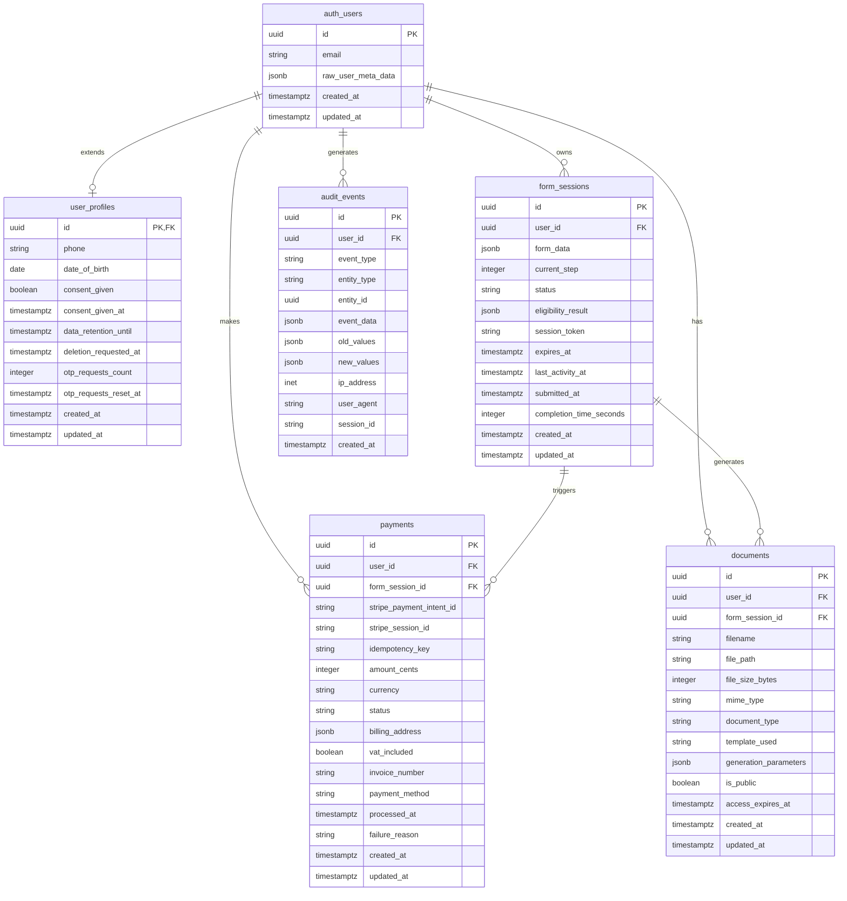
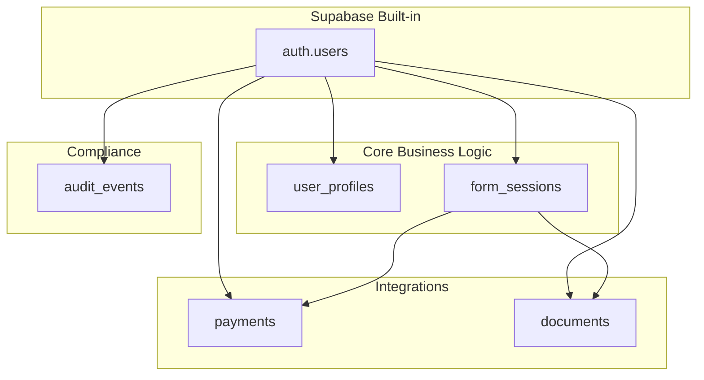
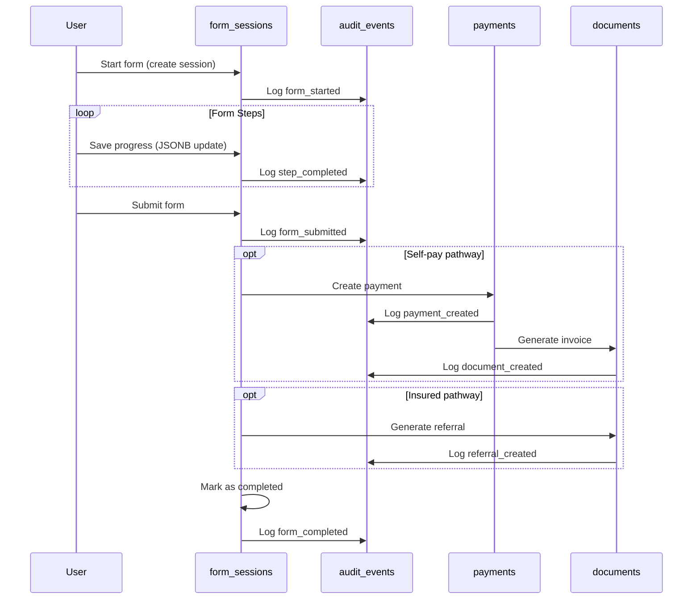
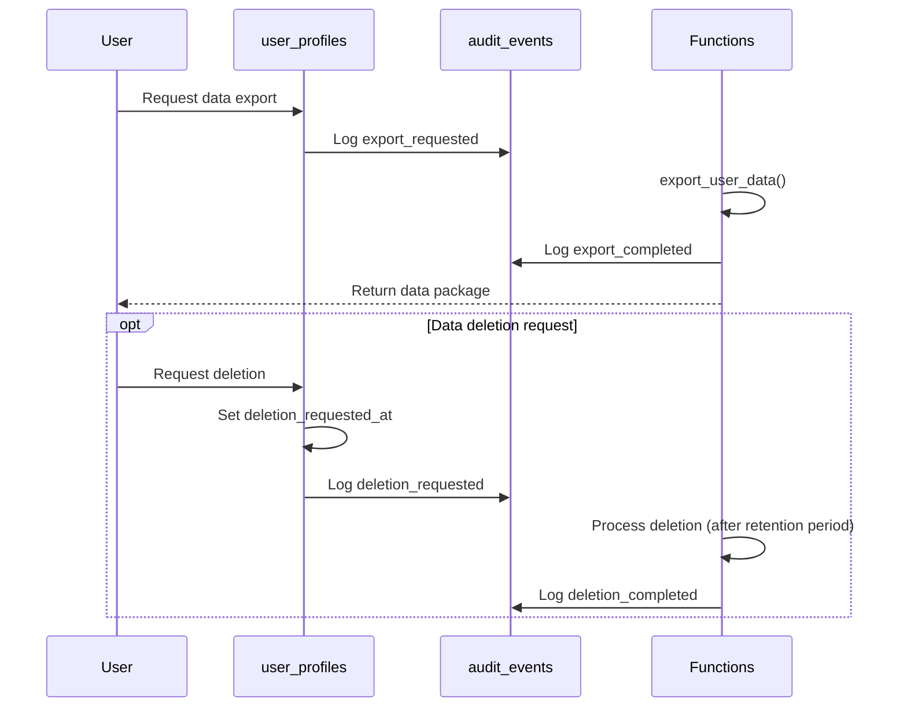
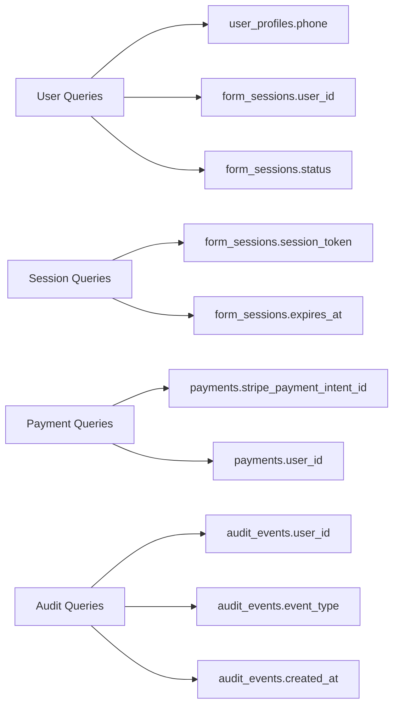
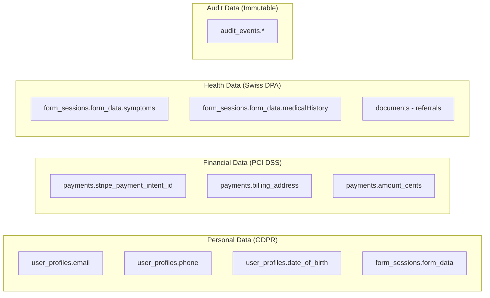
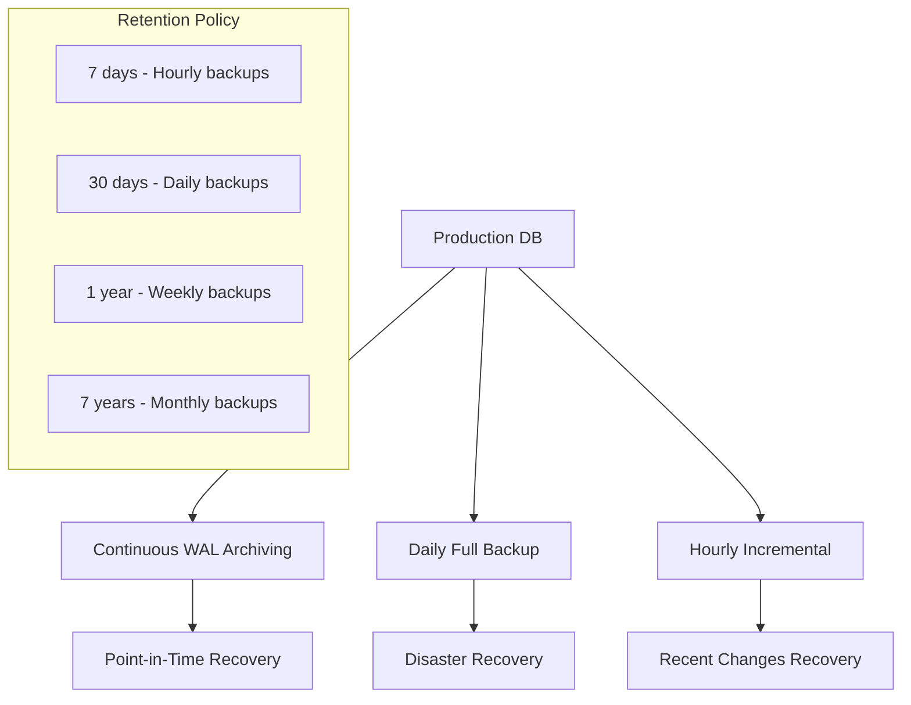
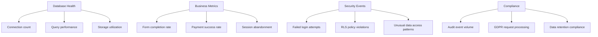

# Database Schema Diagram v2.0

## Entity Relationship Diagram



## Schema Overview

### Core Design Principles

1. **Simplicity**: 5 core tables vs. 20+ in v1.0
2. **Supabase Integration**: Extends built-in `auth.users`
3. **Flexibility**: JSONB for dynamic form data
4. **Compliance**: Full GDPR and Swiss DPA support

### Table Relationships



## Data Flow Patterns

### Form Submission Flow



### GDPR Compliance Flow



## Storage Strategy

### JSONB Usage

```json
// form_sessions.form_data example
{
  "step0": {
    "email": "user@example.com",
    "dateOfBirth": "1990-01-01"
  },
  "step1": {
    "insuranceModel": "basic",
    "hasSymptoms": true,
    "symptoms": ["chest_pain", "shortness_of_breath"],
    "contraindications": []
  },
  "step2": {
    "medicalHistory": {
      "conditions": ["hypertension"],
      "medications": ["lisinopril"],
      "allergies": []
    }
  }
}
```

```json
// form_sessions.eligibility_result example
{
  "eligible": true,
  "pathway": "insured",
  "reason": "Basic insurance with relevant symptoms",
  "riskLevel": "low",
  "requiresGpReferral": true,
  "estimatedCoverage": 80
}
```

### Document Storage

```json
// documents.generation_parameters example
{
  "template": "swiss_gp_referral_v2",
  "language": "de-CH",
  "urgent": false,
  "includeSymptoms": true,
  "includeHistory": true,
  "gpInfo": {
    "name": "Dr. Hans Müller",
    "address": "Hauptstrasse 1, 8001 Zürich",
    "phone": "+41 44 123 4567"
  }
}
```

## Performance Optimization

### Index Strategy



### Query Patterns

```sql
-- Most common queries optimized with indexes

-- 1. User session lookup (< 10ms)
SELECT * FROM form_sessions 
WHERE session_token = ? AND expires_at > NOW();

-- 2. Form progress save (< 50ms)
UPDATE form_sessions 
SET form_data = ?, current_step = ?, updated_at = NOW()
WHERE id = ? AND user_id = ?;

-- 3. Payment status check (< 20ms)
SELECT status, amount_cents FROM payments
WHERE stripe_payment_intent_id = ?;

-- 4. User data export (< 500ms)
SELECT export_user_data(?);
```

## Security Model

### Row Level Security

```mermaid
graph TD
    A[User Request] --> B{Authenticated?}
    B -->|No| C[Denied]
    B -->|Yes| D{RLS Policy Check}
    
    D --> E[user_profiles: auth.uid() = id]
    D --> F[form_sessions: auth.uid() = user_id]
    D --> G[payments: auth.uid() = user_id]
    D --> H[documents: auth.uid() = user_id]
    D --> I[audit_events: auth.uid() = user_id]
    
    E --> J[Allow/Deny]
    F --> J
    G --> J
    H --> J
    I --> J
```

### Data Classification



## Backup and Recovery

### Backup Strategy



### Recovery Scenarios

| Scenario | Recovery Method | RTO | RPO |
|----------|----------------|-----|-----|
| Hardware failure | Supabase automatic failover | < 5 min | < 1 min |
| Data corruption | Point-in-time recovery | < 30 min | < 15 min |
| Accidental deletion | Full backup restore | < 2 hours | < 24 hours |
| Regional disaster | Cross-region replica | < 4 hours | < 1 hour |

## Monitoring and Alerting

### Key Metrics



### Alert Thresholds

| Metric | Warning | Critical |
|--------|---------|----------|
| Connection count | > 80% | > 95% |
| Query response time | > 1s | > 5s |
| Form abandonment rate | > 30% | > 50% |
| Payment failure rate | > 5% | > 10% |
| Audit log gaps | > 1 min | > 5 min |

## Conclusion

The v2.0 database schema provides a clean, efficient, and compliant foundation for the Myant Europe Eligibility Form system. The simplified design reduces operational complexity while maintaining full functionality and regulatory compliance.

**Key Advantages:**
- **Performance**: Optimized for common query patterns
- **Scalability**: Supports high concurrent load
- **Compliance**: Full GDPR and Swiss DPA compliance
- **Maintainability**: Simple, well-documented structure
- **Security**: Comprehensive access controls and audit trails