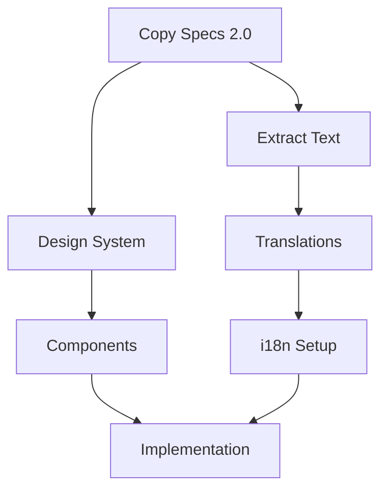

# Process Improvement Analysis
Date: 2025-01-22
Status: CURRENT
Version: 1.0.0

## Executive Summary

This analysis identifies critical improvements needed in our development process to ensure robust documentation, clear specification tracking, and systematic implementation. The review reveals gaps in version control, documentation synchronization, and process automation that must be addressed before v2.0 implementation.

## Critical Findings

### 1. Documentation State Management

**Current Issues:**
- No clear distinction between CURRENT/TARGET/DRAFT states
- Multiple versions of specs without clear authority
- Implementation docs disconnected from specs

**Root Cause:**
The process lacks a formal specification lifecycle that tracks documents from draft → current → implementation → archived.

**Solution:**
Implement a three-tier documentation system:
```
SPECS (Target State) → IMPLEMENTATION (Current Work) → REFERENCE (Final State)
```

### 2. Process Loop Integrity

**Current Issues:**
- Agent lifecycle doesn't enforce documentation updates
- No validation between planning.md and actual implementation
- Event-stream.md can diverge from reality

**Root Cause:**
The 10-step lifecycle has weak enforcement and no automated validation.

**Solution:**
Add validation gates:
```
Plan → Validate Against Specs → Execute → Verify → Document → Validate Documentation
```

### 3. Specification Management

**Current Issues:**
- v2.0 copy specs exist in multiple locations
- No clear mapping from spec → implementation tasks
- Version conflicts between documents

**Root Cause:**
No central specification registry or version control system.

**Solution:**
Create a specification management system with clear versioning and traceability.

## Detailed Process Improvements

### 1. Enhanced CLAUDE.md Structure

```markdown
# CLAUDE.md - Enhanced

## Load Order 2.0
1. Load CLAUDE.md
2. Load CLAUDE_PROCESS.md
3. Load Working Files Canon
4. **NEW**: Load SPEC_REGISTRY.md
5. **NEW**: Validate document versions
6. **NEW**: Check implementation status

## Document State Model
- SPEC: Target state (what we're building toward)
- WIP: Work in progress (current implementation)
- CURRENT: Deployed/active state
- ARCHIVED: Historical reference

## Validation Checkpoints
- [ ] All specs have implementation plans
- [ ] All implementations reference specs
- [ ] All completed work is documented
- [ ] Version numbers are consistent
```

### 2. Specification Registry

```markdown
# /docs/specs/SPEC_REGISTRY.md

## Active Specifications

### Copy Specification
- Version: 2.0
- Status: APPROVED
- Location: /docs/content/iterations/2025-01-22-comprehensive-update/
- Implementation: /docs/IMPLEMENTATION_PLAN_v2.0.md
- Progress: 88% (Missing: protected components)

### Design System
- Version: 1.0 
- Status: APPROVED
- Location: /docs/implementation/design-system-rollout-plan.md
- Implementation: Phase 1 of 4
- Progress: 25%

### Technical Architecture
- Version: 1.5
- Status: CURRENT
- Location: /docs/architecture/
- Implementation: Ongoing
- Progress: 75%

## Version Compatibility Matrix
| Component | Spec Version | Implementation | Current State |
|-----------|--------------|----------------|---------------|
| Copy      | 2.0         | 1.2 → 2.0      | 1.2          |
| Design    | 1.0         | 0.5 → 1.0      | 0.5          |
| i18n      | 2.0         | 1.0 → 2.0      | 1.0          |
```

### 3. Working Files Enhancement

#### Enhanced todo.md Structure
```markdown
# TODO - Specification-Driven Task List
Last Review: 2025-01-22
Next Review: 2025-01-23
Spec Version: 2.0

## 🎯 Current Sprint (Phase 0)
### From SPEC: Copy v2.0, Section 4.1
- [ ] Extract hardcoded text from 20 pages
  - Spec-Ref: COPY_v2.0#4.1
  - Implementation: Phase1#1.1
  - Due: 2025-01-24

## 📋 Phase Backlog
### Phase 1: Foundation
[Tasks organized by spec reference]

## ✅ Recently Completed
[Keep for 7 days then archive]
```

#### Enhanced planning.md Structure
```markdown
# Planning - Implementation Roadmap
Version: 2.0-DRAFT
Spec-Ref: Multiple (see registry)
Status: Phase 0 of 6

## Implementation Matrix
| Phase | Spec Section | Status | Blockers | Progress |
|-------|--------------|---------|----------|----------|
| 0     | Copy 2.0#4.1 | ACTIVE  | None     | 10%      |
| 1     | Copy 2.0#4.2 | QUEUED  | Phase 0  | 0%       |

## Dependency Graph

```

### 4. Process Automation

#### Validation Scripts
```bash
# /scripts/validate-process.sh
#!/bin/bash

# Check version consistency
echo "Checking version consistency..."
grep -h "Version:" docs/**/*.md | sort | uniq -c

# Check spec coverage
echo "Checking specification coverage..."
for spec in docs/specs/*.md; do
  echo "Spec: $spec"
  grep -l "$spec" docs/implementation/*.md || echo "  ⚠️  No implementation found"
done

# Check working file currency
echo "Checking working file updates..."
for file in working_files/*.md; do
  last_modified=$(stat -f %m "$file")
  current_time=$(date +%s)
  age_days=$(( ($current_time - $last_modified) / 86400 ))
  if [ $age_days -gt 7 ]; then
    echo "  ⚠️  $file is $age_days days old"
  fi
done
```

#### Documentation Health Dashboard
```markdown
# /docs/DOCUMENTATION_HEALTH.md
Auto-generated: 2025-01-22

## Health Metrics
- Specs with implementation plans: 2/3 (66%)
- Implementation tasks mapped to specs: 45/67 (67%)
- Working files updated <7 days: 5/5 (100%)
- Documents with version conflicts: 3
- Stale documentation (>30 days): 12

## Action Items
1. Map remaining 22 tasks to specifications
2. Resolve version conflicts in copy documents
3. Archive stale documentation
```

### 5. Continuous Improvement Loop

```markdown
# Process Evolution Protocol

## Weekly Review Checklist
- [ ] Run validation scripts
- [ ] Review documentation health
- [ ] Update spec registry
- [ ] Archive completed items
- [ ] Identify process bottlenecks

## Monthly Improvements
- [ ] Analyze event-stream patterns
- [ ] Update CLAUDE_PROCESS.md with learnings
- [ ] Refine automation scripts
- [ ] Enhance templates

## Quarterly Strategic Review
- [ ] Major process version update
- [ ] Tool evaluation
- [ ] Team feedback integration
- [ ] Success metric analysis
```

## Implementation Priority

### Immediate (Before v2.0 Implementation)
1. Create SPEC_REGISTRY.md
2. Update all current docs with status headers
3. Map all v2.0 tasks to specifications
4. Resolve version conflicts

### Short-term (Week 1)
1. Implement validation scripts
2. Enhance working file structures
3. Create documentation health dashboard
4. Establish review cycles

### Medium-term (Month 1)
1. Automate health checks
2. Create process metrics
3. Implement feedback loops
4. Refine templates

## Success Criteria

1. **Specification Traceability**: 100% of implementation tasks traceable to specs
2. **Documentation Currency**: No critical doc >7 days without review
3. **Version Clarity**: Zero version conflicts
4. **Process Compliance**: 95% of changes follow enhanced lifecycle
5. **Automation Coverage**: 80% of checks automated

## Risk Mitigation

| Risk | Impact | Mitigation |
|------|---------|------------|
| Process overhead | High | Automate validation |
| Adoption resistance | Medium | Gradual rollout |
| Tool complexity | Medium | Simple scripts first |
| Documentation debt | High | Dedicated cleanup sprint |

## Conclusion

The enhanced process provides:
- Clear specification → implementation flow
- Automated validation and health checks
- Systematic documentation maintenance
- Continuous improvement mechanisms

This positions us for successful v2.0 implementation with full traceability and quality assurance.