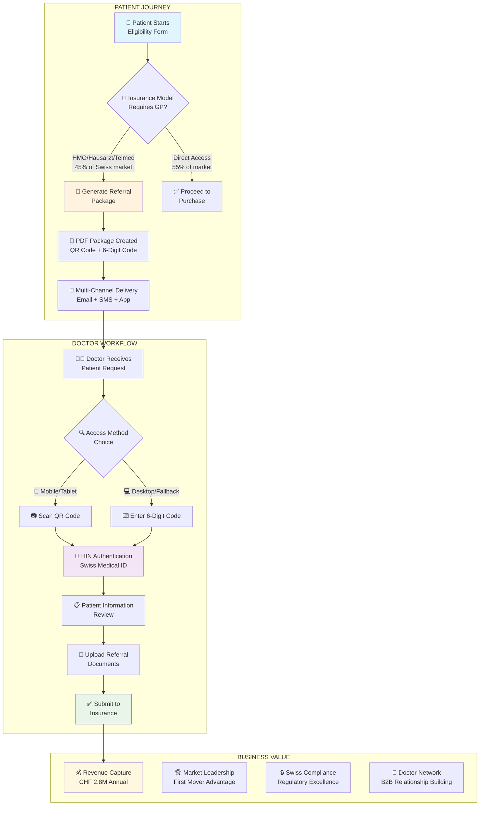
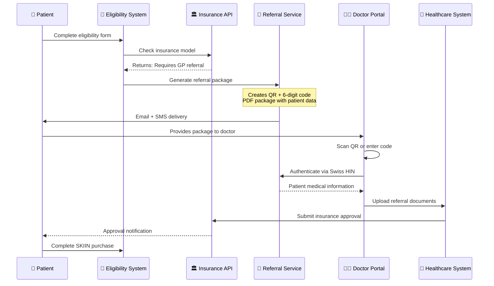
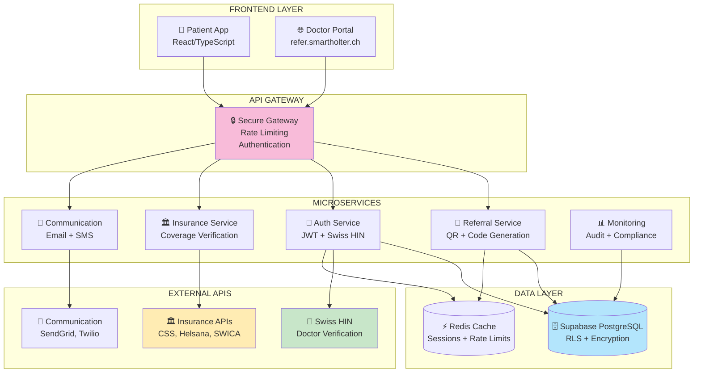
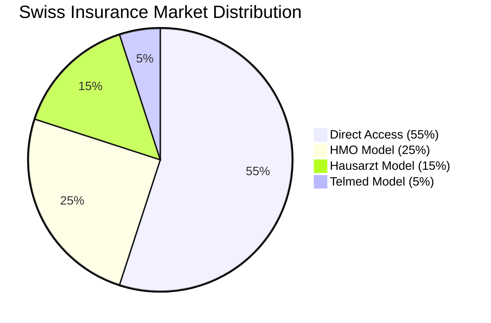
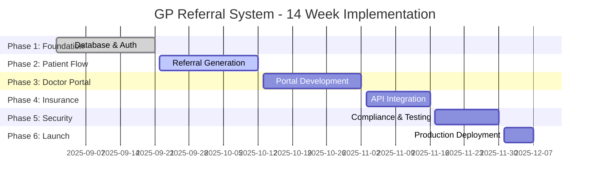
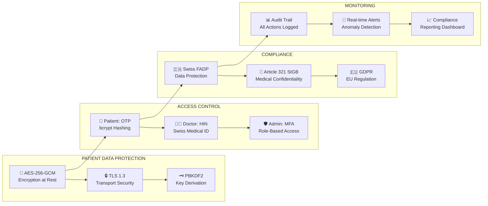
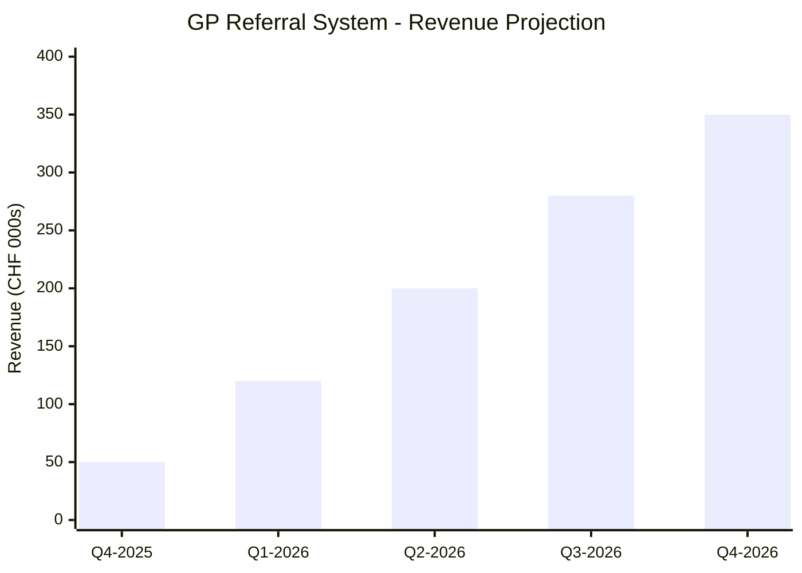
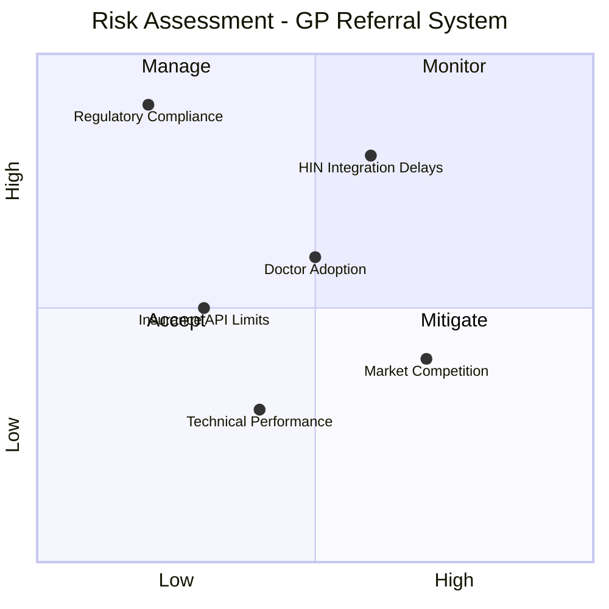
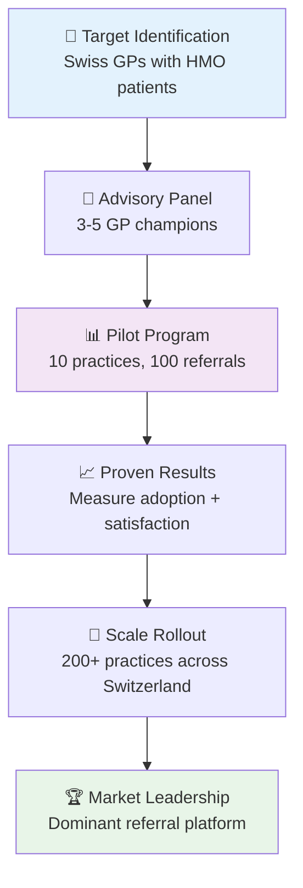
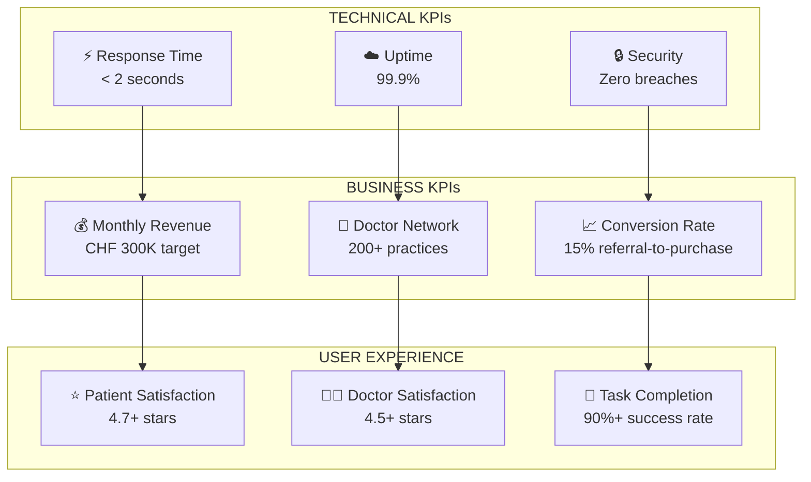

# GP Referral System - Visual Process Flowchart
**VERSION**: 1.0  
**DATE**: August 22, 2025  
**PURPOSE**: CEO Presentation Visual Aid  
**FORMAT**: Executive-Ready Flowchart Documentation  

## Executive Process Overview

## Detailed Patient Journey Flow

## System Architecture Diagram

## Revenue Impact Visualization

**GP Referral Required: 45% of Swiss Market = CHF 2.8M Annual Opportunity**

## Implementation Timeline Gantt

## Security & Compliance Framework

## Financial Projections Visualization

**Key Financial Metrics:**
- **Break-even**: Month 8.5
- **Year 1 ROI**: 280%
- **Year 2 ARR**: CHF 2.8M
- **Payback Period**: 8.5 months

## Risk Assessment Matrix

## Go-to-Market Strategy Flow

## Success Metrics Dashboard

---

## Executive Summary for Presentation

**This visual flowchart demonstrates:**

1. **Clear Value Proposition**: CHF 2.8M annual revenue opportunity from 45% of Swiss market
2. **Technical Excellence**: Robust, secure, compliant system architecture
3. **Implementation Clarity**: 14-week delivery timeline with defined milestones
4. **Risk Management**: Comprehensive risk assessment with mitigation strategies
5. **Market Leadership**: First-mover advantage in Swiss healthcare workflow automation

**Recommended Action**: Approve CHF 210,000 investment for immediate implementation start.

---
**Document Type**: CEO Presentation Visual Aid  
**Approval Required**: Executive Leadership Sign-off  
**Next Review**: Implementation Milestone Gates (Weeks 3, 6, 9, 11, 13)