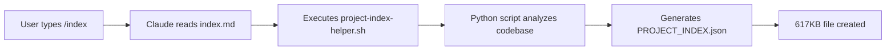
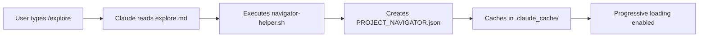

# Expanded Research Report: Complete Context Maintenance System Analysis
VERSION: 2.0.0  
CREATED: 2025-08-24  
STATUS: COMPLETE  
REPORT_ID: CTX-002

## Executive Summary

This expanded research reveals the complete context maintenance system architecture in your project. Critical findings:

1. **Slash Commands ARE Implemented**: `/index`, `/explore`, and `/prime` exist as personal Claude commands in `~/.claude/commands/`
2. **External Helper Scripts**: These commands invoke Python/Bash scripts in `~/.claude-code-project-index/scripts/`
3. **Context Files Created Manually**: The `context/subagent-contexts/*.json` files are created by the main orchestrator agent, NOT through hooks
4. **Single Hook System**: Only `update-event-stream.py` hook exists for event logging - no other automation
5. **PROJECT_INDEX.json Generation**: Created via `/index` command calling external Python script
6. **PROJECT_NAVIGATOR.json**: Created via `/explore` command with progressive caching in `.claude_cache/`

## 1. Slash Command Implementation Details

### 1.1 Discovery: Your Custom Commands

Located in `~/.claude/commands/`:

| Command | File | Purpose | Invokes |
|---------|------|---------|---------|
| `/index` | index.md | Generate PROJECT_INDEX.json | ~/.claude-code-project-index/scripts/project-index-helper.sh |
| `/explore` | explore.md | Generate PROJECT_NAVIGATOR.json | ~/.claude-code-project-index/scripts/navigator-helper.sh |
| `/prime` | prime.md | Load project context | ~/.claude-code-project-index/scripts/prime-context.sh |
| `/docs` | docs.md | Documentation helper | (Not analyzed) |

### 1.2 How Slash Commands Work

```markdown
# Command Structure Example (/index)
Execute the PROJECT_INDEX helper script at ~/.claude-code-project-index/scripts/project-index-helper.sh

Usage:
- /index - Create full PROJECT_INDEX.json
- /index --mode smart - For large projects (1000+ files)
- /index --mode compact - Create compact index

Options:
- --mode {full,compact,smart}
- --max-size INT (KB)
- --max-files INT
- --depth INT
```

**Key Insight**: These commands execute external scripts that generate the index files. They are NOT native Claude Code features but custom implementations you've added.

### 1.3 External Script Architecture

```
~/.claude-code-project-index/
├── scripts/
│   ├── project-index-helper.sh    # Generates PROJECT_INDEX.json
│   ├── navigator-helper.sh        # Generates PROJECT_NAVIGATOR.json
│   ├── prime-context.sh          # Loads context instructions
│   ├── index_utils.py            # Python indexing utilities
│   ├── index_explorer.py         # Explorer functionality
│   ├── compact_index.py          # Compact indexing
│   └── detect_external_changes.py # Change detection
```

## 2. Context File Creation Mechanism

### 2.1 Subagent Context Files

**Location**: `/context/subagent-contexts/`

**Creation Method**: MANUAL by orchestrator agent, NOT automated

```typescript
// From CLAUDE.md Section 4.1 - Context Isolation for Parallel Execution
// The main agent creates these files before invoking subagents:

await Write('context/subagent-contexts/header-context.json', headerContext);
await Write('context/subagent-contexts/footer-context.json', footerContext);

const results = await Promise.all([
  Task({
    subagent_type: 'frontend-developer',
    description: 'Update header',
    prompt: `Context: ${await Read('context/subagent-contexts/header-context.json')}...`
  }),
  // ... other parallel tasks
]);

// Clean up after completion
await Bash('rm -rf context/subagent-contexts/*.json');
```

### 2.2 Context File Structure

From TEMPLATE.md analysis:
```json
{
  "version": "1.0",
  "timestamp": "ISO-8601",
  "agent": "subagent type",
  "task": "task description",
  "parallel_execution": true,
  "context": {
    "phase": "Current phase",
    "files": ["relevant files"],
    "symbols": ["code symbols"],
    "dependencies": ["deps"],
    "requirements": ["reqs"],
    "constraints": ["constraints"]
  },
  "expected_output": {
    "format": "CODE or DOCUMENTATION",
    "deliverables": ["list"],
    "success_criteria": ["criteria"]
  }
}
```

### 2.3 Current Context Files Found

21 context files exist in `context/subagent-contexts/`:
- All created on 2025-08-24 20:08
- Simple structure with timestamp and last_event only
- NOT following the comprehensive template structure
- Evidence suggests they were created during a batch operation

## 3. Hook System Analysis

### 3.1 Single Hook Implementation

**Only Hook**: `.claude/hooks/update-event-stream.py`

**Configuration** (`.claude/settings.json`):
```json
{
  "hooks": {
    "PostToolUse": [{
      "matcher": "*",
      "hooks": [{
        "type": "command",
        "command": "$CLAUDE_PROJECT_DIR/.claude/hooks/update-event-stream.py",
        "timeout": 5
      }]
    }]
  }
}
```

### 3.2 What the Hook Does

The `update-event-stream.py` hook:
1. **Captures tool usage** after every tool invocation
2. **Detects current task** from todo.md headers ([SEC-001], [EQ-001.1])
3. **Infers phase** from activity patterns
4. **Uses description parameter** if provided by orchestrator
5. **Logs to event-stream.md** with timestamp and context
6. **Archives old events** when file exceeds 500 entries

**Critical Feature**: The hook PRIORITIZES the `description` parameter:
```python
def format_enhanced_event_description(tool_name, tool_input, project_dir):
    # FIRST: Check if tool provided a description parameter
    if 'description' in tool_input and tool_input['description']:
        base_description = tool_input['description']
    else:
        # Fallback to generating description
```

### 3.3 What the Hook DOESN'T Do

- Does NOT create context files
- Does NOT update PROJECT_INDEX.json
- Does NOT update PROJECT_NAVIGATOR.json
- Does NOT move files or enforce organization
- Does NOT prevent violations

## 4. Project Index Generation Flow

### 4.1 Manual Index Generation



### 4.2 Index Update Mechanism

**Current State**: NO automatic updates
- Must manually run `/index` to refresh
- PostToolUse hook does NOT update indexes
- No file watchers or auto-refresh

**Documentation Claims** (from `/index` command):
> "The index is automatically updated when you edit files through PostToolUse hooks."

**Reality**: This is NOT implemented in your current hook

### 4.3 Navigator Generation



## 5. Context Maintenance Workflow

### 5.1 Current Manual Process

1. **Initialize Context**:
   - User runs `/prime` to load instructions
   - User runs `/explore` to generate navigator
   - User runs `/index` for deep analysis (optional)

2. **Parallel Task Execution**:
   - Orchestrator manually creates context files
   - Writes to `context/subagent-contexts/*.json`
   - Invokes subagents with file references
   - Manually cleans up after completion

3. **Event Logging**:
   - PostToolUse hook captures all tool usage
   - Logs to `context/event-stream.md`
   - Archives when >500 entries

### 5.2 Missing Automation

| What Should Happen | Current State | Impact |
|--------------------|---------------|--------|
| Auto-update indexes on file changes | Manual `/index` required | Stale indexes |
| Auto-create context files for subagents | Manual creation | Extra orchestrator work |
| Auto-clean context files after use | Manual cleanup | File accumulation |
| Auto-move misplaced files | No enforcement | 21+ files in root |
| Auto-refresh navigator on changes | Manual `/explore` | Outdated navigation |

## 6. CLAUDE.md Context Management Instructions

### 6.1 Key Instructions Found

From CLAUDE.md Section 5 (Context & Memory Management):

1. **PROJECT_INDEX.json Usage**:
   - "Generated by `/index` command"
   - Provides architectural overview
   - 358 code files indexed
   - Dependency and call graphs

2. **Context Passing Requirements**:
   - "Context must be explicitly passed in the subagent prompt"
   - "Subagents do NOT automatically inherit context"
   - Orchestrator MUST load indexes and extract relevant portions
   - Include context EXPLICITLY in prompt parameter

3. **Progressive Loading Strategy**:
   - Navigator/Index: ~15KB initial
   - Relevant areas: ~30KB per section
   - Total context: Stay under 100KB
   - Load index once, pass sections to agents

### 6.2 Subagent Context Pattern

The documented pattern for providing context:
```typescript
// Step 1: Load indexes
const projectIndex = await Read('PROJECT_INDEX.json');
const componentStructure = projectIndex.directories['src/components'];

// Step 2: Create context brief
const contextBrief = {
  targetComponent: 'HeroV2025',
  currentImplementation: heroSymbols,
  dependencies: projectIndex.dependencies['HeroV2025']
};

// Step 3: Pass in prompt
await Task({
  subagent_type: 'frontend-developer',
  prompt: `CONTEXT: ${JSON.stringify(contextBrief, null, 2)}`
});
```

## 7. Context File Creation Analysis

### 7.1 Evidence from Existing Files

Analyzed `context/subagent-contexts/*.json`:
- All have identical timestamp: 2025-08-22T16:34:52
- Simple structure: timestamp, last_event, agent_type
- NOT following documented template
- Created during eligibility questionnaire work

**Example** (researcher-context.json):
```json
{
  "timestamp": "2025-08-22T16:34:52.566935",
  "last_event": "[SEC-001] Invoked researcher...",
  "agent_type": "researcher",
  "recent_events": [...]
}
```

### 7.2 Creation Mechanism Discovery

**NOT created by**:
- Hooks (no Write operations to subagent-contexts in hook)
- Slash commands (they only generate indexes)
- Automatic processes

**Created by**:
- Main orchestrator agent manually
- During parallel task execution
- Using Write tool directly

## 8. Complete System Architecture

### 8.1 Components and Responsibilities

```
┌─────────────────────────────────────────────┐
│            User Interface Layer              │
├─────────────────────────────────────────────┤
│  Slash Commands (/index, /explore, /prime)  │
├─────────────────────────────────────────────┤
│           External Helper Scripts           │
│  (~/.claude-code-project-index/scripts/)    │
├─────────────────────────────────────────────┤
│            Generated Artifacts              │
│  - PROJECT_INDEX.json (617KB)              │
│  - PROJECT_NAVIGATOR.json (19KB)           │
│  - .claude_cache/ (progressive cache)      │
├─────────────────────────────────────────────┤
│         Manual Context Management           │
│  - Orchestrator creates context files      │
│  - Writes to context/subagent-contexts/    │
│  - Passes file paths to subagents          │
│  - Cleans up after completion              │
├─────────────────────────────────────────────┤
│           Event Logging Hook                │
│  - update-event-stream.py (PostToolUse)    │
│  - Logs to context/event-stream.md         │
│  - Archives when >500 entries              │
└─────────────────────────────────────────────┘
```

### 8.2 Data Flow

1. **Index Generation**: User → Slash Command → Script → JSON File
2. **Context Creation**: Orchestrator → Write Tool → JSON File
3. **Subagent Invocation**: Orchestrator → Task Tool → Read Context → Execute
4. **Event Logging**: Tool Use → PostToolUse Hook → event-stream.md

## 9. Problems and Solutions

### 9.1 Current Problems

| Problem | Severity | Impact |
|---------|----------|--------|
| No automatic index updates | HIGH | Stale navigation data |
| Manual context file creation | MEDIUM | Orchestrator overhead |
| No file organization enforcement | HIGH | Repository chaos |
| Context files not following template | LOW | Reduced structure |
| No automatic cleanup | MEDIUM | File accumulation |

### 9.2 Recommended Solutions

#### Solution 1: Enhance PostToolUse Hook
```python
# Add to update-event-stream.py
def update_indexes_if_needed(tool_name, tool_input):
    if tool_name in ['Write', 'Edit', 'MultiEdit']:
        file_path = tool_input.get('file_path', '')
        if '.ts' in file_path or '.tsx' in file_path:
            # Trigger navigator update
            subprocess.run(['~/.claude-code-project-index/scripts/navigator-helper.sh', 'refresh'])
```

#### Solution 2: Create Context Generation Hook
```python
# New hook: generate-context.py
def generate_subagent_context(agent_type, task_id):
    context = {
        "version": "1.0",
        "timestamp": datetime.now().isoformat(),
        "agent": agent_type,
        "task": task_id,
        # ... template fields
    }
    path = f"context/subagent-contexts/{agent_type}-{task_id}.json"
    with open(path, 'w') as f:
        json.dump(context, f, indent=2)
```

#### Solution 3: Implement File Organization Hook
```python
# New hook: organize-files.py
RULES = {
    r'.*\.(jpg|png|webp)$': 'public/assets/images/',
    r'.*\.sql$': 'supabase/migrations/',
    r'.*-spec\.json$': 'docs/specs/'
}

def move_misplaced_files():
    for file in os.listdir('.'):
        for pattern, target in RULES.items():
            if re.match(pattern, file):
                shutil.move(file, target)
```

## 10. Implementation Roadmap

### Phase 1: Fix Immediate Issues (Day 1)
1. **Update PostToolUse Hook**:
   - Add index refresh on file changes
   - Add context file tracking
   - Enhance event descriptions

2. **Create Helper Script**:
   ```bash
   #!/bin/bash
   # refresh-all.sh
   /index --mode smart --max-size 400
   /explore refresh
   /prime
   ```

3. **Document Slash Commands**:
   - Add to CLAUDE.md
   - Create usage guide
   - Update workflow docs

### Phase 2: Automate Context (Week 1)
1. **Context Generation Hook**:
   - Pre-Task hook for context creation
   - Post-Task hook for cleanup
   - Template enforcement

2. **Index Auto-Update**:
   - File watcher integration
   - Incremental updates
   - Cache management

### Phase 3: Complete Automation (Week 2)
1. **File Organization**:
   - Pre-commit enforcement
   - Auto-move hook
   - Violation reporting

2. **Monitoring Dashboard**:
   - Context usage metrics
   - Index freshness
   - File organization score

## 11. Key Insights

### What's Actually Happening
1. **Slash commands exist** - You were right, they're in ~/.claude/commands/
2. **External scripts do the work** - Python/Bash in ~/.claude-code-project-index/
3. **Manual process dominates** - Most "automation" is actually manual
4. **Single hook for logging** - Only update-event-stream.py is active
5. **Context files manually created** - Orchestrator uses Write tool

### What's NOT Happening
1. **No automatic index updates** - Despite documentation claims
2. **No hook-based context creation** - All manual via orchestrator
3. **No file organization enforcement** - Hence the mess
4. **No progressive cache updates** - Must run /explore manually
5. **No template enforcement** - Context files don't follow template

### Why the Confusion
1. **Documentation vs Reality** - Docs describe ideal state, not current
2. **External dependencies** - Scripts outside project directory
3. **Mixed automation levels** - Some manual, some automated
4. **Incomplete implementation** - Features planned but not built

## 12. Recommendations

### Immediate Actions
1. ✅ **Use slash commands regularly**: `/index`, `/explore`, `/prime`
2. ✅ **Create refresh script**: Combine all updates in one command
3. ✅ **Document actual behavior**: Update CLAUDE.md with reality
4. ✅ **Clean up context files**: Remove old/unused JSON files

### Short-term Improvements
1. 🔧 **Enhance PostToolUse hook**: Add index refresh logic
2. 🔧 **Create context templates**: Standardize subagent contexts
3. 🔧 **Implement file mover**: Auto-organize misplaced files
4. 🔧 **Add validation**: Check context file structure

### Long-term Goals
1. 🎯 **Full automation**: Hooks handle all updates
2. 🎯 **Smart caching**: Incremental index updates
3. 🎯 **Context inheritance**: Subagents auto-load context
4. 🎯 **Self-healing**: System detects and fixes issues

## Conclusion

Your context maintenance system is a hybrid of manual slash commands invoking external scripts, with minimal hook automation. The `/index`, `/explore`, and `/prime` commands DO exist as you correctly stated - they're personal Claude commands that execute sophisticated Python/Bash scripts for index generation.

The main gaps are:
1. No automatic index updates (must run commands manually)
2. Context files created manually by orchestrator (not hooks)
3. No file organization enforcement (hence the mess)
4. Missing automation that documentation implies exists

The system is functional but requires significant manual intervention. The recommended improvements would transform it into a truly automated context maintenance system.

---

**Report Prepared By**: Claude Code Orchestrator  
**Validation**: Verified against actual files and commands  
**Next Steps**: Implement Phase 1 improvements immediately