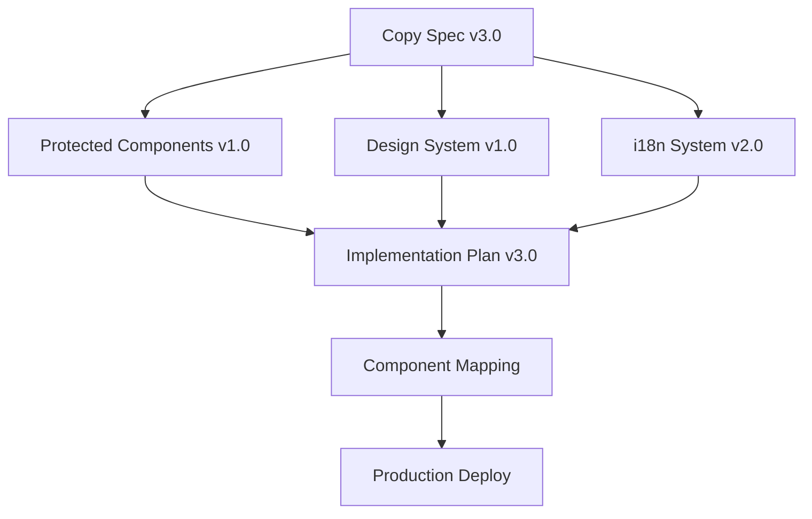

# Specification Registry
Version: 1.0
Last Updated: 2025-01-22
Status: ACTIVE

## Overview

This registry serves as the single source of truth for all SKIIN Switzerland specifications. It tracks version numbers, implementation status, and dependencies between specifications.

## Active Specifications

### 1. Copy Specification
- **Current Version**: 3.0 (2025-01-22)
- **Status**: APPROVED - PENDING IMPLEMENTATION
- **Location**: `/docs/UPDATE-WEBSITE-COPY-v3-Jul-22-2025.md`
- **Progress**: 88% complete
  - ✅ Homepage content (all variants)
  - ✅ About section
  - ✅ How It Works
  - ✅ Pricing structure
  - ⚠️ Protected components (12% gap - now specified)
  - ❌ Italian translations (0% - pending)
  - ⚠️ German/French sections incomplete (Solutions, Partners, MVCP)
- **Key Changes in v3.0**:
  - Product renaming (10-Day Heart Screening, SKIIN 3X Screening™)
  - Italian language addition
  - Enhanced emotional messaging themes
  - Family/caregiver focus

### 2. Protected Components Specification
- **Current Version**: 1.0 (2025-01-22)
- **Status**: APPROVED - PENDING IMPLEMENTATION
- **Location**: `/docs/specs/protected-components/PROTECTED_COMPONENTS_SPEC_v1.md`
- **Components**:
  - HeartBalanceRing (cardiac health score visualization)
  - ContributingFactorCards (5 lifestyle factors)
  - TabNavigation (results navigation)
  - TodayTab (daily risk assessment)
- **Compliance**: Requires medical board and CEO approval for changes

### 3. Design System Specification
- **Current Version**: 1.0 (2025-01-18)
- **Status**: PARTIALLY IMPLEMENTED
- **Location**: `/docs/implementation/design-system-rollout-plan.md`
- **Progress**: 25% (Phase 1 of 4)
- **Components**:
  - Theme system (4 themes)
  - Progressive components
  - Typography (IBM Plex Sans pending)
  - Color system (CSS variables)

### 4. Technical Architecture
- **Current Version**: 1.5 (2025-01-20)
- **Status**: CURRENT - IN PRODUCTION
- **Progress**: 75%
- **Stack**:
  - React 18 + TypeScript 5
  - Vite bundler
  - TailwindCSS + shadcn/ui
  - TanStack Query v5
- **Missing**:
  - CMS integration
  - Advanced calculator logic
  - Email template system

### 5. Implementation Plan
- **Current Version**: 3.0 (2025-01-22)
- **Status**: ACTIVE
- **Location**: `/docs/V2_COPY_CLEANUP_AND_INTEGRATION_PLAN.md`
- **Timeline**: 6 weeks
- **Current Phase**: 0.1 (Italian infrastructure)
- **Next Phase**: 1.0 (Copy integration)

## Version Compatibility Matrix

| Component | Spec Version | Implementation | Production | Notes |
|-----------|--------------|----------------|------------|-------|
| Copy EN | 3.0 | 2.0 → 3.0 | 2.0 | Product names outdated |
| Copy DE | 3.0 | 2.0 → 3.0 | 2.0 | Missing sections |
| Copy FR | 3.0 | 2.0 → 3.0 | 2.0 | Missing sections |
| Copy IT | 3.0 | 0.0 → 3.0 | N/A | New in v3.0 |
| Protected Components | 1.0 | 0.0 → 1.0 | 0.0 | Not implemented |
| Design System | 1.0 | 0.5 → 1.0 | 0.5 | Phase 1 active |
| i18n System | 2.0 | 1.0 → 2.0 | 1.0 | Italian pending |

## Specification Dependencies

## Change Management Process

### Specification Updates
1. **Draft** - Create new version in `/docs/specs/drafts/`
2. **Review** - Technical and stakeholder review
3. **Approval** - Sign-off required based on impact
4. **Registry Update** - Update this file with new version
5. **Archive** - Move old version to `/docs/archive/YYYY-MM-DD/`

### Approval Requirements
| Change Type | Approvers Required |
|-------------|-------------------|
| Copy updates | Marketing + Product |
| Protected components | CEO + Medical Board |
| Technical architecture | CTO + Engineering |
| Design system | Design + Product |
| Pricing | CEO + Finance |

## Implementation Tracking

### Current Sprint (Week of Jan 22, 2025)
- [ ] Complete protected components specification ✅
- [ ] Create Italian copy document
- [ ] Update German/French missing sections
- [ ] Integrate v3.0 copy changes
- [ ] Archive obsolete documents

### Blocked Items
- Italian routing (infrastructure needed)
- Protected components (awaiting CEO approval)
- Canton-specific content (research required)
- Email templates (12 of 15 missing)

## Quality Metrics

| Metric | Target | Current | Status |
|--------|--------|---------|--------|
| Spec completeness | 100% | 92% | ⚠️ |
| Implementation coverage | 100% | 45% | ❌ |
| Test coverage | 80% | 0% | ❌ |
| Documentation currency | <7 days | 2 days | ✅ |
| Translation sync | 100% | 75% | ⚠️ |

## Next Review Date

- **Scheduled**: 2025-01-29 (weekly)
- **Focus**: Italian implementation progress
- **Participants**: Product, Engineering, Design

## Reference Documents

### Specifications
- `/docs/UPDATE-WEBSITE-COPY-v3-Jul-22-2025.md` - Latest copy spec
- `/docs/specs/protected-components/PROTECTED_COMPONENTS_SPEC_v1.md` - Protected components
- `/docs/implementation/design-system-rollout-plan.md` - Design system
- `/docs/V2_COPY_TO_COMPONENT_MAPPING.md` - Implementation guide

### Reports
- `/docs/content/iterations/2025-01-22-copy-update-v2/` - All test reports
- `/docs/PROJECT_AUDIT_2025-01-18.md` - Project status
- `/docs/V2_COPY_CLEANUP_AND_INTEGRATION_PLAN.md` - Cleanup plan

### Process
- `/working_files/CLAUDE_PROCESS.md` - Development methodology
- `/docs/process-review/PROCESS_IMPROVEMENT_ANALYSIS.md` - Process gaps

---

*This registry is the authoritative source for specification versions. Any discrepancies should be reported immediately.*