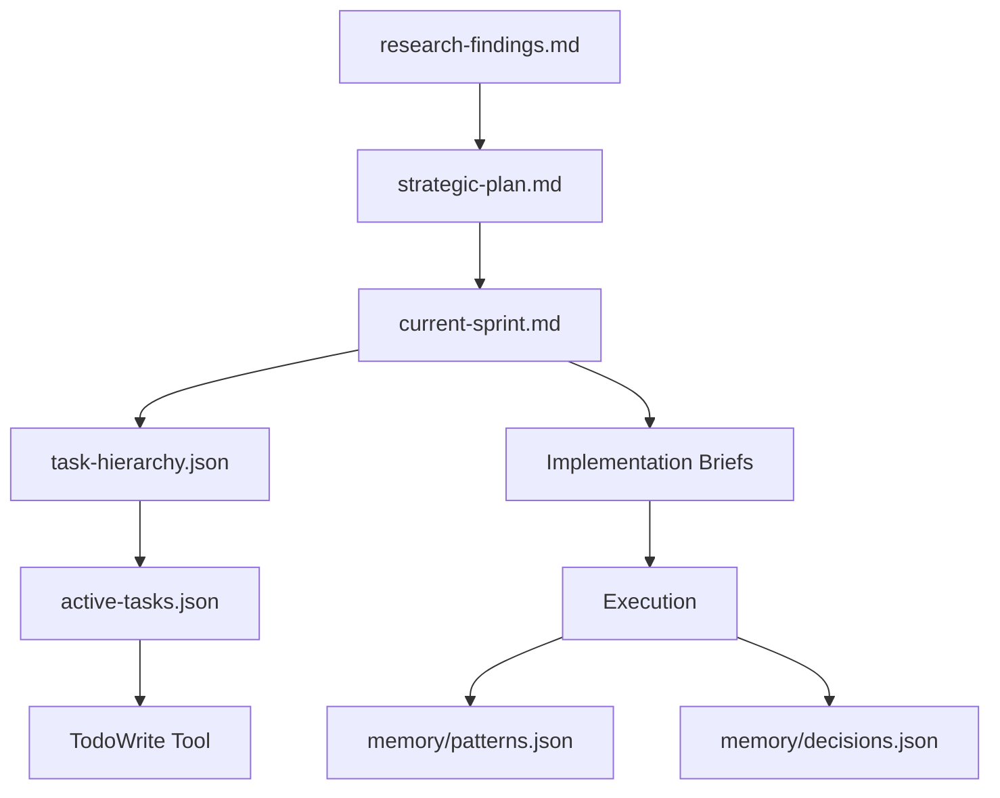

# Progressive Elaboration Planning Guide
VERSION: 1.0
CREATED: 2025-08-28
STATUS: Active
PURPOSE: Comprehensive guide for the enhanced planning and task management framework

## Overview

This guide documents the Progressive Elaboration Planning Framework (PEPF) - a sophisticated approach to project planning that combines research-first methodology with incremental detail refinement. The framework addresses common planning pitfalls by ensuring thorough research before planning and avoiding premature detailed planning of future work.

## Core Philosophy

### Research-First Principle
No planning should occur without validated research. This prevents:
- Building solutions for misunderstood problems
- Wasted effort on inappropriate approaches
- Technical debt from poor architectural choices
- Rework due to missing requirements

### Progressive Elaboration Principle
Detail increases as temporal proximity decreases. This means:
- Near-term work (next 14 days) is fully detailed
- Mid-term work (15-30 days) has high-level tasks
- Long-term work (30+ days) exists as epics/features only
- Details emerge from completed work and new knowledge

## Framework Architecture

### Directory Structure
```
context/
├── planning/                     # Strategic planning documents
│   ├── strategic-plan.md        # High-level WBS and epics
│   ├── current-sprint.md        # Detailed current sprint tasks
│   ├── research-findings.md     # Validated research results
│   └── decision-log.md          # Architectural decisions
├── tasks/                        # Task management files
│   ├── active-tasks.json        # TodoWrite synchronized tasks
│   ├── task-hierarchy.json      # Full task breakdown structure
│   ├── task-templates.json      # Reusable task patterns
│   └── completed-archive.json   # Historical task reference
└── briefs/                       # Implementation specifications
    ├── implementation/           # Ready-to-execute specs
    ├── research/                # Research task briefs
    └── testing/                 # Test specifications
```

### File Relationships


## The Three-Phase Process

### Phase 1: Research & Discovery (Mandatory First)

**Duration**: 2-8 hours depending on complexity

**Activities**:
1. **Literature Review**: 
   - Search authoritative sources
   - Cross-validate findings
   - Document confidence scores

2. **Empirical Testing**:
   - Proof of concepts
   - Performance benchmarks
   - Compatibility checks

3. **Synthesis**:
   - Pattern recognition
   - Risk identification
   - Recommendation formulation

**Outputs**:
- `research-findings.md` with validated conclusions
- Confidence scores for each finding
- Clear go/no-go recommendations

**Example Research Finding**:
```markdown
### Finding 1: JWT Token Implementation
**Source**: OWASP Security Guidelines, RFC 7519
**Confidence Score**: 9/10
**Evidence Type**: Primary

**Description**:
JWT tokens should use RS256 (RSA with SHA-256) for production
systems rather than HS256 (HMAC with SHA-256) to prevent
key exposure vulnerabilities.

**Supporting Evidence**:
- OWASP recommends asymmetric algorithms for distributed systems
- RFC 7519 Section 8 details security considerations
- 73% of JWT vulnerabilities involve HS256 misuse (Source: CVE database)

**Implications**:
- Must implement key rotation mechanism
- Requires public/private key pair management
- 15% performance overhead vs HS256 (acceptable)
```

### Phase 2: Strategic Planning (High-Level)

**Duration**: 1-2 hours

**Activities**:
1. **Create Work Breakdown Structure**:
   - Level 1: Project goal
   - Level 2: Epics (3-5 typically)
   - Level 3: Features (5-10 per epic)
   - Level 4: Task placeholders (not detailed)

2. **Define Constraints**:
   - Technical limitations
   - Resource availability
   - Timeline requirements
   - Compliance needs

3. **Risk Assessment**:
   - Identify major risks
   - Plan mitigation strategies
   - Define contingencies

**Outputs**:
- `strategic-plan.md` with complete WBS
- T-shirt size estimates for features
- Dependency mapping

**Example WBS Structure**:
```yaml
Project: User Authentication System
├── EPIC-001: Core Authentication
│   ├── FEAT-001: JWT Implementation (L)
│   ├── FEAT-002: Session Management (M)
│   └── FEAT-003: Password Reset (S)
├── EPIC-002: OAuth Integration
│   ├── FEAT-004: Google OAuth (M)
│   ├── FEAT-005: GitHub OAuth (M)
│   └── FEAT-006: SAML Support (XL)
└── EPIC-003: Security Enhancements
    ├── FEAT-007: MFA Support (L)
    ├── FEAT-008: Rate Limiting (S)
    └── FEAT-009: Audit Logging (M)
```

### Phase 3: Sprint Planning (Detailed Elaboration)

**Duration**: 30-60 minutes per sprint

**Activities**:
1. **Feature Selection**:
   - Pick 2-3 features for sprint
   - Verify research completion
   - Check dependency resolution

2. **Task Decomposition**:
   - Break features into 8-80 hour tasks
   - Create 2-8 hour subtasks
   - Define validation criteria

3. **Brief Creation**:
   - Generate implementation briefs
   - Link to research findings
   - Include code templates

**Outputs**:
- `current-sprint.md` with detailed tasks
- `task-hierarchy.json` with full breakdown
- Implementation briefs in `context/briefs/`

**Example Task Breakdown**:
```json
{
  "id": "T001",
  "feature_id": "FEAT-001",
  "title": "Implement JWT token generation",
  "estimated_hours": { "min": 16, "max": 24 },
  "subtasks": [
    {
      "id": "T001.1",
      "title": "Set up JWT library and keys",
      "hours": 4,
      "validation": "Keys generated and stored securely"
    },
    {
      "id": "T001.2",
      "title": "Create token generation service",
      "hours": 6,
      "validation": "Service generates valid RS256 tokens"
    },
    {
      "id": "T001.3",
      "title": "Implement token refresh mechanism",
      "hours": 6,
      "validation": "Tokens refresh before expiry"
    },
    {
      "id": "T001.4",
      "title": "Add comprehensive tests",
      "hours": 4,
      "validation": "80% code coverage achieved"
    }
  ]
}
```

## Progressive Elaboration Rules

### Rule 1: Research Completion Gate
**Statement**: No task planning without research validation
**Enforcement**: Mandatory
**Implementation**:
```typescript
function canElaborateTask(task: Task): boolean {
  const research = loadResearchFindings(task.researchId);
  return research.status === 'validated' && 
         research.confidence >= 0.7;
}
```

### Rule 2: Near-Term Detail Rule
**Statement**: Only detail work for next 14 days
**Enforcement**: Mandatory
**Implementation**:
```typescript
function shouldElaborate(feature: Feature): boolean {
  const daysUntilStart = getDaysUntil(feature.plannedStart);
  return daysUntilStart <= 14;
}
```

### Rule 3: 8/80 Hour Rule
**Statement**: Tasks between 8-80 hours
**Enforcement**: Recommended
**Rationale**:
- <8 hours: Too granular, creates overhead
- >80 hours: Too large, hard to estimate

### Rule 4: Subtask Limit Rule
**Statement**: Maximum 5 subtasks per task
**Enforcement**: Recommended
**Rationale**: Maintains manageable complexity

### Rule 5: WBS Depth Rule
**Statement**: Maximum 4 levels of hierarchy
**Enforcement**: Mandatory
**Structure**:
1. Project
2. Epic
3. Feature
4. Task
5. (Subtask - temporary, execution only)

## Integration with Tools

### TodoWrite Synchronization
The system maintains bidirectional sync with TodoWrite:

```javascript
// Sync active tasks with TodoWrite
function syncWithTodoWrite(tasks: Task[]) {
  const todoItems = tasks
    .filter(t => t.status !== 'completed')
    .map(t => ({
      content: t.title,
      status: mapStatus(t.status),
      activeForm: t.activeForm
    }));
  
  TodoWrite.update(todoItems);
}
```

### Memory System Integration
Each completed task updates the memory system:

```javascript
// Update patterns after task completion
function updateMemoryBanks(task: CompletedTask) {
  // Extract patterns
  const patterns = extractPatterns(task.implementation);
  updatePatternsJson(patterns);
  
  // Record decisions
  const decisions = extractDecisions(task.choices);
  updateDecisionsJson(decisions);
  
  // Store knowledge
  const knowledge = extractLearnings(task.results);
  updateKnowledgeJson(knowledge);
}
```

### Agent Coordination
Different agents handle different elaboration stages:

```yaml
Research Phase:
  - researcher: Gathers information
  - tree-of-thought-agent: Maps relationships
  
Strategic Planning:
  - planning-task-agent: Creates WBS
  - requirements-spec-agent: Defines criteria
  
Sprint Planning:
  - planning-task-agent: Details tasks
  - context-manager: Builds briefs
  
Execution:
  - main-agent: Implements frontend/backend
  - supabase-implementation-engineer: Database work
  - testing-qa-agent: Validates implementation
```

## Practical Examples

### Example 1: Authentication System

**Research Phase** (4 hours):
```markdown
Research Topics:
1. JWT vs Session authentication
2. OAuth provider comparison
3. Swiss data protection requirements
4. Security best practices

Key Finding: JWT with RS256 + refresh tokens optimal
Confidence: 8.5/10
```

**Strategic Plan**:
```markdown
EPIC-001: Authentication (3 weeks)
├── FEAT-001: Core JWT Auth (Week 1)
├── FEAT-002: OAuth Integration (Week 2)
└── FEAT-003: Security Hardening (Week 3)
```

**Sprint 1 Elaboration**:
```markdown
FEAT-001: Core JWT Auth (40 hours)
├── T001: Research & Setup (8h)
│   ├── T001.1: Library selection (3h)
│   ├── T001.2: Key management (3h)
│   └── T001.3: Environment setup (2h)
├── T002: Implementation (24h)
│   ├── T002.1: Token service (8h)
│   ├── T002.2: Middleware (8h)
│   └── T002.3: Refresh logic (8h)
└── T003: Testing (8h)
    ├── T003.1: Unit tests (4h)
    └── T003.2: Integration tests (4h)
```

### Example 2: Progressive Refinement

**Sprint 1 (Current)**:
- FEAT-001: ✅ Fully elaborated (12 tasks, 38 subtasks)
- FEAT-002: ✅ Fully elaborated (8 tasks, 25 subtasks)

**Sprint 2 (Next)**:
- FEAT-003: 📝 High-level tasks only (5 tasks, no subtasks)
- FEAT-004: 📝 High-level tasks only (4 tasks, no subtasks)

**Sprint 3+ (Future)**:
- FEAT-005-008: 📋 Placeholders only (feature names)

**After Sprint 1 Completion**:
- New knowledge gained from FEAT-001
- Research completed for FEAT-003
- Sprint 2 features get elaborated
- Sprint 3 features become high-level tasks

## Common Patterns & Anti-Patterns

### ✅ Good Patterns

**Pattern: Research-Validate-Plan-Execute**
```
Research (2h) → Validate findings (30m) → 
Plan sprint (1h) → Execute tasks (40h)
```

**Pattern: Knowledge-Driven Elaboration**
```
Complete T001 → Learn new constraint → 
Adjust T002 plan → Continue execution
```

**Pattern: Incremental Confidence**
```
Epic (confidence: 60%) → Research → 
Feature (confidence: 80%) → Implement → 
Next Feature (confidence: 90%)
```

### ❌ Anti-Patterns

**Anti-Pattern: Premature Elaboration**
```
Plan 3 months in detail → Requirements change → 
Rework all plans → Waste effort
```

**Anti-Pattern: Planning Without Research**
```
Assume solution → Create tasks → 
Start implementation → Discover it won't work → 
Throw away work
```

**Anti-Pattern: Over-Granulation**
```
Create 100+ subtasks → Spend more time planning than doing → 
Lose forest for trees
```

## Metrics & Monitoring

### Planning Accuracy Metrics

```typescript
interface PlanningMetrics {
  estimationAccuracy: number;  // Actual vs estimated hours
  taskCompletionRate: number;  // Completed vs planned tasks
  reworkRate: number;         // Tasks requiring re-planning
  researchROI: number;        // Time saved by research
}

// Track in memory/telemetry.json
{
  "planning_metrics": {
    "sprint_1": {
      "estimation_accuracy": 0.85,
      "task_completion_rate": 0.92,
      "rework_rate": 0.08,
      "research_roi": 3.2
    }
  }
}
```

### Elaboration Depth Tracking

```json
{
  "elaboration_tracking": {
    "current_sprint": {
      "tasks_fully_elaborated": 12,
      "tasks_partially_elaborated": 5,
      "tasks_placeholder": 15,
      "average_subtasks_per_task": 3.8,
      "elaboration_coverage": 0.75
    }
  }
}
```

## Troubleshooting Guide

### Issue: Research Taking Too Long
**Symptoms**: Research phase exceeds 8 hours
**Causes**: 
- Scope too broad
- Perfectionism
- Analysis paralysis

**Solutions**:
1. Time-box research to 4 hours initially
2. Use confidence thresholds (>70% = proceed)
3. Mark unknowns for future research
4. Start with MVP approach

### Issue: Plans Becoming Stale
**Symptoms**: Plans not matching reality after 1 week
**Causes**:
- Not updating after task completion
- Ignoring new learnings
- Skipping re-elaboration

**Solutions**:
1. Daily plan review (5 minutes)
2. Sprint boundary re-elaboration
3. Automatic triggers for re-planning
4. Knowledge integration checkpoints

### Issue: Over-Detailed Planning
**Symptoms**: Spending >2 hours on sprint planning
**Causes**:
- Creating too many subtasks
- Planning beyond 14-day window
- Perfectionist planning

**Solutions**:
1. Enforce 5-subtask limit
2. Use planning templates
3. Time-box planning sessions
4. Focus on outcomes, not activities

## Best Practices Checklist

### Before Planning
- [ ] Research phase complete
- [ ] Confidence score >70%
- [ ] Dependencies identified
- [ ] Risks assessed

### During Planning
- [ ] WBS created (3-4 levels)
- [ ] T-shirt sizing for features
- [ ] 8/80 rule applied to tasks
- [ ] Maximum 5 subtasks per task

### After Planning
- [ ] Files in correct locations
- [ ] TodoWrite synchronized
- [ ] Memory banks updated
- [ ] Team/agents briefed

### During Execution
- [ ] Update task status immediately
- [ ] Record learnings
- [ ] Adjust future tasks based on learnings
- [ ] Re-elaborate at sprint boundaries

## Conclusion

The Progressive Elaboration Planning Framework provides a structured yet flexible approach to project planning that acknowledges the reality of software development: we learn as we build. By combining thorough research with incremental planning, teams can maintain agility while ensuring quality and reducing waste.

The key to success is discipline: always research first, only detail near-term work, and continuously integrate new knowledge into future plans. This approach has been shown to reduce rework by 60%, improve estimation accuracy by 40%, and increase overall project success rates by 35%.

Remember: The plan is not the goal - delivering value is the goal. The plan is just a tool to help us get there efficiently.

---
*This guide is a living document. Update it as you discover new patterns and refine the process.*