# Revised Implementation Planning - Target Specifications Alignment

## Executive Summary

After deep analysis of target specifications, this is a comprehensive plan to transform the current basic implementation into a production-ready medical device marketing website that meets Swiss healthcare standards.

**Key Insight**: Target specifications require medical-grade sophistication, not basic marketing site functionality.

## Implementation Strategy

### Approach: Iterative Professional Development
Following CLAUDE_PROCESS principles:
1. **Understand** → Complete gap analysis (✅ Done)
2. **Plan** → Detailed phased implementation 
3. **Implement** → Systematic component-by-component building
4. **Review** → Medical professional validation at each phase
5. **Iterate** → Continuous refinement to target standards

## Phase 1: Critical Foundation (Days 1-3)
**Goal**: Establish working baseline with core functionality

### 1.1 Translation System Repair
**Priority**: P0 - Blocking all multilingual functionality
- Debug and fix `useTranslation` hook
- Implement proper language context propagation
- Test language switching across all content
- **Acceptance Criteria**: All 3 languages display correctly

### 1.2 Core Page Implementation
**Priority**: P0 - Required for basic navigation
```typescript
// Missing pages to implement:
- /how-it-works (with 5-step process visualization)
- /evidence (clinical studies and data presentation)  
- /about (company background and team)
- /faq (comprehensive Q&A system)
- /contact (functional form with proper validation)
```

### 1.3 Professional Navigation System
**Priority**: P1 - Target specifies sophisticated navigation
- Implement intra-page anchor navigation
- Add secondary navigation menus
- Create contextual cross-linking between pages
- Mobile hamburger menu with full functionality

### 1.4 Contact Form Medical Compliance
**Priority**: P0 - Required for lead generation
- GDPR-compliant data collection
- Medical inquiry categorization
- Secure data transmission
- Professional follow-up workflows

## Phase 2: Medical Component Development (Days 4-6)
**Goal**: Implement healthcare-specific functionality

### 2.1 Citation System Implementation
**Target Requirement**: Inline medical citations for credibility
```typescript
// New component: Citation.tsx
interface CitationProps {
  id: string;
  text: string;
  source: string;
  url?: string;
}

// Usage: "SKIIN detected 7x more arrhythmias<Citation id="1" />
```

### 2.2 Process Visualization System
**Target Requirement**: 5-step patient journey with medical accuracy
- Prescription/Enrollment process
- Device setup and patient onboarding
- Monitoring period with medical context
- AI-powered analysis explanation
- Medical report delivery system

### 2.3 Evidence Presentation System
**Target Requirement**: Clinical data visualization
- Study results presentation
- Patient case studies with medical context
- Regulatory compliance badges
- Clinical trial data charts

### 2.4 Insurance and Coverage System
**Target Requirement**: Swiss healthcare system integration
- Accordion with insurance provider information
- Coverage explanation for patients
- Billing code information for physicians
- Cantonal coverage variations

## Phase 3: Content Strategy Implementation (Days 7-8)
**Goal**: Medical-grade content with professional validation

### 3.1 Medical Content Development
**Target Requirement**: Evidence-based marketing copy
- Clinical claims with proper citations
- Medical terminology accuracy
- Swiss healthcare context adaptation
- Regulatory compliance verification

### 3.2 Case Study Development
**Target Requirement**: Patient success stories with medical context
```typescript
// Example target case study structure:
{
  title: "Undiagnosed AF Case",
  patientProfile: "60-year-old male, sporadic dizziness",
  previousTesting: "Normal 24h Holter",
  skiinResults: "Multiple short AF episodes over 14 days",
  outcome: "Timely anticoagulation, stroke prevention",
  clinicalImpact: "Demonstrates extended monitoring value"
}
```

### 3.3 Professional Translation
**Target Requirement**: Medical-grade multilingual content
- Clinical terminology accuracy
- Swiss cultural adaptation
- Healthcare regulatory compliance per language
- Professional medical translator review

### 3.4 Regulatory Content
**Target Requirement**: Swiss healthcare compliance
- CE marking documentation
- Swiss medical device regulations
- Privacy policy with medical context
- Terms of use for healthcare services

## Phase 4: Design System Alignment (Days 9-10)
**Goal**: Match target visual specifications exactly

### 4.1 Color System Update
**Target Requirement**: Medical professional color palette
```css
/* Update from current myant colors to target medical colors */
Primary: #1A73E8 (medical trust blue)
Secondary: #0BB5A2 (innovation teal)
Neutral: Medical-grade grays
Accent: Carefully chosen medical context colors
```

### 4.2 Typography Implementation
**Target Requirement**: Medical professional typography
- Helvetica Neue or medical-grade alternatives
- Accessibility-compliant sizing
- Medical document-style hierarchy
- International character support

### 4.3 Accessibility Compliance
**Target Requirement**: WCAG 2.1 AA medical standards
- Screen reader compatibility for medical content
- Keyboard navigation for all interactions
- Color contrast verification for medical context
- Alternative text for medical imagery

### 4.4 Medical Imagery Integration
**Target Requirement**: Professional healthcare photography
- Patient scenarios with medical context
- Device imagery with clinical settings
- Inclusive representation of Swiss population
- Professional medical equipment imagery

## Phase 5: Advanced Features (Days 11-12)
**Goal**: Production-ready medical website features

### 5.1 Analytics for Medical Devices
**Target Requirement**: Healthcare-compliant tracking
- HIPAA-equivalent data handling
- Medical device marketing compliance
- Patient privacy protection
- Healthcare professional behavior tracking

### 5.2 Advanced Integration Features
**Target Requirement**: Healthcare system integration
- EMR compatibility mentions
- Clinical workflow integration
- Medical billing system compatibility
- Healthcare provider portal concepts

### 5.3 Performance Optimization
**Target Requirement**: Medical-grade reliability
- Healthcare industry performance standards
- Medical device website reliability
- Critical uptime requirements
- Professional loading standards

### 5.4 Security Implementation
**Target Requirement**: Medical data security
- Healthcare data protection standards
- Swiss medical privacy compliance
- Secure medical communication protocols
- Professional data handling procedures

## Resource Requirements

### Technical Development
- **Frontend Developer**: 10-12 days React/TypeScript
- **Medical UI/UX Designer**: 3-4 days healthcare-specific design
- **Accessibility Expert**: 2 days WCAG compliance
- **Performance Specialist**: 1 day medical-grade optimization

### Content Development
- **Medical Content Writer**: 5-6 days evidence-based copy
- **Clinical Reviewer**: 2-3 days medical validation
- **Professional Translator**: 3-4 days medical DE/FR translation
- **Regulatory Consultant**: 1-2 days Swiss compliance review

### Quality Assurance
- **Medical QA Specialist**: 2-3 days healthcare testing
- **Accessibility Tester**: 1 day compliance verification
- **Cross-browser Tester**: 1 day compatibility testing
- **Medical Professional Review**: 1 day final validation

## Risk Management

### High-Risk Areas
1. **Medical Compliance**: Complex healthcare regulations
2. **Professional Translation**: Medical terminology accuracy critical
3. **Clinical Validation**: Medical claims require professional review
4. **Timeline Pressure**: Target sophistication requires adequate time

### Mitigation Strategies
1. **Professional Services**: Engage medical content experts immediately
2. **Iterative Validation**: Regular healthcare professional review
3. **Compliance First**: Prioritize regulatory requirements
4. **Quality Gates**: No phase progression without validation

## Success Metrics

### Technical Metrics
- [ ] All 8 target pages implemented and functional
- [ ] Translation system working across all languages
- [ ] WCAG 2.1 AA compliance verified
- [ ] Medical-grade performance standards met

### Content Metrics
- [ ] All medical claims properly cited
- [ ] Professional translation accuracy verified
- [ ] Swiss healthcare compliance achieved
- [ ] Medical professional validation complete

### Business Metrics
- [ ] Patient journey fully functional
- [ ] Physician workflow completely supported
- [ ] Lead generation system operational
- [ ] Medical credibility established

## Implementation Timeline

```mermaid
gantt
    title SKIIN Swiss Pages - Target Implementation
    dateFormat X
    axisFormat %d
    
    section Phase 1: Foundation
    Translation Repair       :done, p1a, 0, 1
    Core Pages              :active, p1b, 1, 3
    Navigation System       :p1c, 2, 3
    
    section Phase 2: Medical Components  
    Citation System         :p2a, 3, 4
    Process Visualization   :p2b, 4, 5
    Evidence System        :p2c, 5, 6
    
    section Phase 3: Content
    Medical Content        :p3a, 6, 7
    Case Studies          :p3b, 7, 8
    Professional Translation :p3c, 7, 8
    
    section Phase 4: Design
    Color System Update    :p4a, 8, 9
    Typography            :p4b, 9, 10
    Accessibility         :p4c, 9, 10
    
    section Phase 5: Production
    Advanced Features     :p5a, 10, 11
    Security & Performance :p5b, 11, 12
    Final Validation      :p5c, 12, 12
```



## Conclusion

This revised plan transforms the project from a basic marketing site to a sophisticated medical device marketing platform meeting Swiss healthcare standards. The target specifications demand medical-grade professionalism, and this plan delivers that level of quality through systematic, expert-validated development.

**Key Success Factor**: Medical professional involvement throughout the process ensures compliance and credibility essential for healthcare industry success.